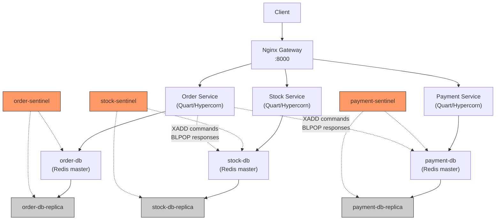
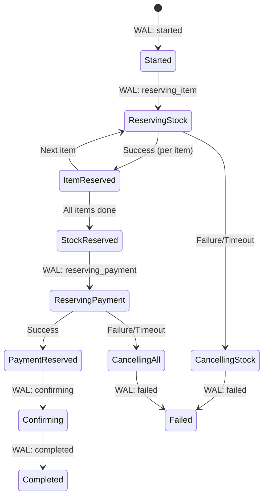
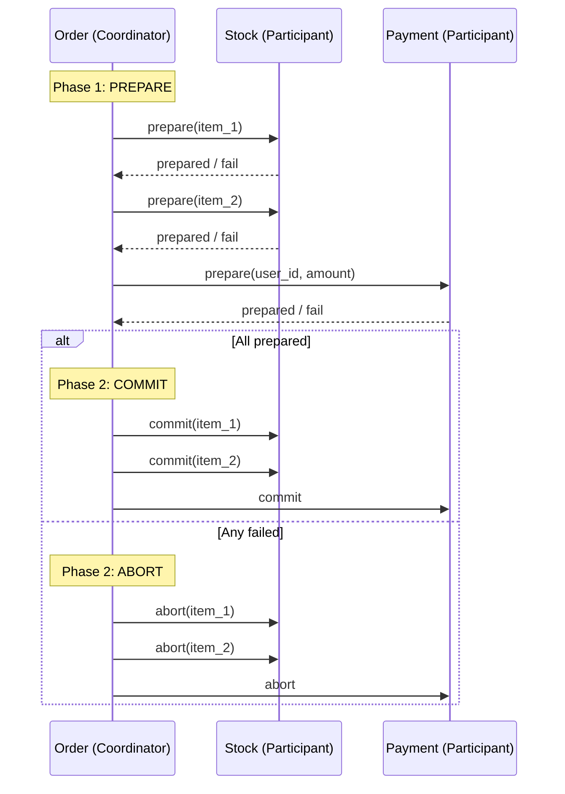
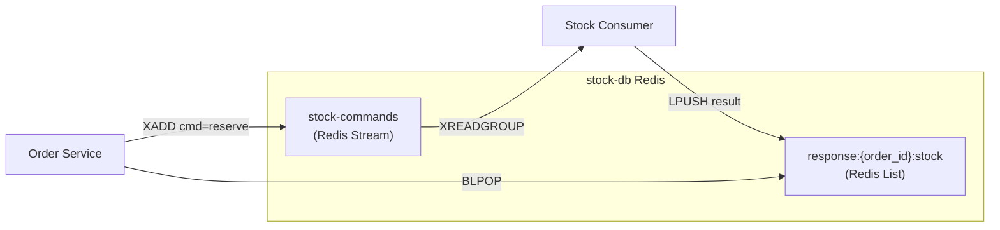
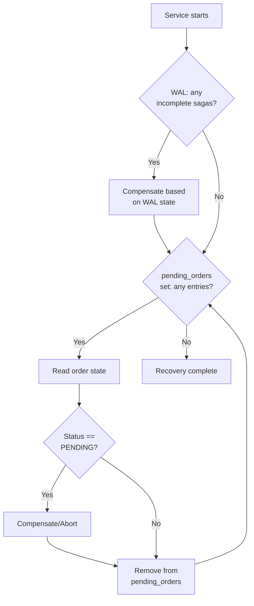

# Distributed Data Systems — Project Overview

A Redis-native microservices platform implementing distributed checkout transactions with dual-protocol support (SAGA and 2PC), built on an async Python stack with full fault-tolerance infrastructure.

---

## Table of Contents

1. [System Architecture](#1-system-architecture)
2. [Service Decomposition](#2-service-decomposition)
3. [Data Models and Storage Design](#3-data-models-and-storage-design)
4. [Transaction Protocols](#4-transaction-protocols)
5. [Inter-Service Communication](#5-inter-service-communication)
6. [Atomicity and Concurrency Control](#6-atomicity-and-concurrency-control)
7. [Idempotency](#7-idempotency)
8. [Write-Ahead Log (WAL)](#8-write-ahead-log-wal)
9. [Crash Recovery](#9-crash-recovery)
10. [Reconciliation](#10-reconciliation)
11. [Infrastructure and Deployment](#11-infrastructure-and-deployment)
12. [Fault Tolerance Design](#12-fault-tolerance-design)
13. [Performance Design](#13-performance-design)
14. [External API Contract](#14-external-api-contract)
15. [Design Decision Register](#15-design-decision-register)

---

## 1. System Architecture

### High-Level Topology



### Container Inventory (13 containers)

| Container | Image | Role |
|-----------|-------|------|
| `gateway` | nginx:1.25-bookworm | HTTP reverse proxy, path-based routing |
| `order-service` | order:latest | Saga/2PC coordinator, REST API |
| `stock-service` | stock:latest | Stock management, stream consumer |
| `payment-service` | user:latest | Credit management, stream consumer |
| `order-db` | redis:7.2-bookworm | Order data (master) |
| `order-db-replica` | redis:7.2-bookworm | Order data (read replica) |
| `order-sentinel` | redis:7.2-bookworm | Sentinel for order-db failover |
| `stock-db` | redis:7.2-bookworm | Stock data + command stream (master) |
| `stock-db-replica` | redis:7.2-bookworm | Stock data (read replica) |
| `stock-sentinel` | redis:7.2-bookworm | Sentinel for stock-db failover |
| `payment-db` | redis:7.2-bookworm | Payment data + command stream (master) |
| `payment-db-replica` | redis:7.2-bookworm | Payment data (read replica) |
| `payment-sentinel` | redis:7.2-bookworm | Sentinel for payment-db failover |

### Why This Topology

The core architectural principle is **decentralized data management** (as described by Martin Fowler). Each service owns its database exclusively. No shared data store exists. The order service coordinates distributed transactions by writing commands directly to the stock and payment databases' command streams, rather than going through a shared event bus.

**Design decision: No shared event-bus.** The original architecture used a shared Redis instance as a message broker. This was a single point of failure — if it went down, all inter-service communication stopped. By moving command streams onto each service's own Redis, we eliminate this central dependency. The trade-off is that the order service needs network connectivity to all three Redis instances, but this is simpler to reason about than a shared broker.

---

## 2. Service Decomposition

### Order Service (`order/`)

**Role:** Saga/2PC coordinator. Owns the order lifecycle.

**Files:**
| File | Purpose |
|------|---------|
| `app.py` | Quart application, REST endpoints, lifecycle management |
| `saga.py` | SAGA orchestrator (WAL-backed) |
| `tpc.py` | Two-Phase Commit coordinator |
| `wal.py` | Write-Ahead Log using Redis Streams |
| `recovery.py` | Crash recovery (WAL + pending set) |
| `reconciliation.py` | Periodic integrity checker |
| `requirements.txt` | Dependencies: quart, hypercorn, redis[hiredis], httpx, msgspec |
| `Dockerfile` | Container build |

**Redis connections (3):**
1. `order-db` — own database (orders, pending set, WAL stream)
2. `stock-db` — writes commands to `stock-commands` stream, reads `response:*` lists
3. `payment-db` — writes commands to `payment-commands` stream, reads `response:*` lists

**Design decision: Order service connects to all 3 Redis instances.** This is the key architectural choice that eliminates the shared event bus. The order service acts as the transaction coordinator and needs to send commands to participants. Rather than routing through a shared broker, it writes directly to each participant's command stream on their own Redis. This gives us:
- No single point of failure for inter-service communication
- Lower latency (one hop instead of two)
- Clear ownership: each service's Redis is its own domain
- The order service is the only service that needs cross-Redis connectivity

### Stock Service (`stock/`)

**Role:** Manages item inventory. Participant in checkout transactions.

**Files:**
| File | Purpose |
|------|---------|
| `app.py` | Quart application, REST + stream consumer, Lua scripts |
| `requirements.txt` | Dependencies: quart, hypercorn, redis[hiredis] |
| `Dockerfile` | Container build |

**Redis connections (1):** `stock-db` only.

The stock service has no knowledge of other services. It reads commands from its own `stock-commands` stream and writes responses to `response:{order_id}:stock` lists on its own Redis. The order service reads these responses by connecting to stock-db.

### Payment Service (`payment/`)

**Role:** Manages user credit. Participant in checkout transactions.

Same architecture as stock, with `payment-commands` stream and `response:{order_id}:payment` lists.

---

## 3. Data Models and Storage Design

### Order Data Model

Orders are stored as msgpack-encoded structs keyed by UUID:

```python
class OrderValue(Struct):
    paid: bool                      # whether this order has been paid for
    items: list[tuple[str, int]]    # [(item_id, quantity), ...]
    user_id: str                    # who placed this order
    total_cost: int                 # total price in credits
    checkout_status: str = ""       # "", "PENDING", "COMMITTED", "ABORTED"
    checkout_step: str = ""         # "", "STOCK", "PAYMENT", "PREPARE", "COMMIT", "ABORT", "DONE"
```

**Design decision: msgpack over JSON.** Orders use `msgspec.msgpack` for serialization because:
- It's binary, smaller than JSON
- `msgspec` provides zero-copy decoding which is faster than `json.loads`
- The `Struct` type gives us compile-time field validation
- Order data is opaque to Redis (only the order service reads it), so human readability doesn't matter

**Design decision: Checkout state fields.** Two fields track the checkout lifecycle:
- `checkout_status` is the high-level state: `PENDING` → `COMMITTED` or `ABORTED`
- `checkout_step` tracks which participant is currently being contacted

This dual-field approach enables recovery: if the service crashes, recovery can read these fields to determine exactly where the saga was and what compensating actions are needed.

### Stock Data Model (Redis Hash)

Each item is stored as a Redis Hash:

```
HSET <item_id>
    available_stock    <int>    # stock available for new reservations
    reserved_stock     <int>    # stock held by in-flight transactions
    price              <int>    # price per unit
```

**Design decision: Hash over msgpack blob.** The previous implementation stored a single `stock` integer as a msgpack-encoded struct. The Hash model was chosen because:
1. **Atomic field operations.** `HINCRBY` atomically increments a single field without reading/decoding the entire record. This eliminates the need for `WATCH`/`MULTI`/`EXEC` optimistic locking for simple operations like `add_stock`.
2. **Two-column reservation model.** Separating `available_stock` from `reserved_stock` provides isolation between concurrent transactions. A SAGA reserves stock by moving units from `available` to `reserved` — other concurrent SAGAs see the reduced `available` and fail fast rather than creating conflicting reservations.
3. **Debuggability.** A Redis Hash can be inspected with `HGETALL` directly, without needing a msgpack decoder.

**Design decision: Two-column reservation model.** This is inspired by the TCC (Try-Confirm-Cancel) pattern from the system design document:
- **Try:** `available_stock -= N` (Lua script checks sufficiency atomically)
- **Confirm:** `reserved_stock -= N` (stock is consumed)
- **Cancel:** `available_stock += N` (stock is returned)

In the current SAGA implementation, we use a simplified version where stock is subtracted from `available_stock` during reserve and added back during compensate. The `reserved_stock` field is present for future TCC integration.

### Payment Data Model (Redis Hash)

```
HSET <user_id>
    available_credit   <int>    # credit available for new transactions
    held_credit        <int>    # credit locked by in-flight transactions
```

Same rationale as stock — `HINCRBY` for atomic operations, two-column model for isolation.

### Why Not SQL?

Redis was chosen for its operational simplicity in a microservices context:
- No schema migrations
- Built-in pub/sub and streaming (Redis Streams)
- Sub-millisecond latency for all operations
- AOF persistence provides durability guarantees sufficient for this domain
- Single-threaded model eliminates internal concurrency bugs

---

## 4. Transaction Protocols

The system supports two distributed transaction protocols, switchable via the `TX_MODE` environment variable (`saga` or `2pc`).

### 4.1 SAGA Protocol

The SAGA orchestrator (`order/saga.py`) implements a sequential forward-compensating saga:



**Execution flow:**

1. **WAL: log "started"** with all items, user_id, total_cost
2. **Clear old idempotency keys** (in case this is a retry)
3. **Mark order as PENDING** (persisted to order-db)
4. **For each item** in the order:
   a. **WAL: log "reserving_item"** with item_id and quantity
   b. Send `reserve` command to `stock-commands` stream on stock-db
   c. Read response via `BLPOP response:{order_id}:stock` on stock-db
   d. If success: **WAL: log "item_reserved"**, add to reserved list
   e. If failure: compensate all reserved items, mark ABORTED, return
5. **WAL: log "stock_reserved"**
6. **WAL: log "reserving_payment"**
7. Send `deduct` command to `payment-commands` stream on payment-db
8. Read response via `BLPOP response:{order_id}:payment` on payment-db
9. If failure: compensate all stock + payment, mark ABORTED, return
10. **WAL: log "payment_reserved"**
11. **WAL: log "confirming"**
12. Mark order as COMMITTED + paid=True
13. **WAL: log "completed"**

**Design decision: Sequential per-item reservation.** Items are reserved one at a time rather than in parallel. This simplifies compensation logic — if item 3 fails, we know exactly which items (1, 2) need compensating. Parallel reservation would require tracking partial successes and failures atomically, adding significant complexity for marginal latency improvement in the common case.

**Design decision: Compensation retry with result checking.** Compensating transactions are retried up to 3 times with a 10-second timeout each. The compensate handler is idempotent (checked via idempotency key), so retries are safe. After 3 failures, we log an error but continue — the reconciliation worker will catch residual inconsistencies.

### 4.2 Two-Phase Commit (2PC) Protocol

The 2PC coordinator (`order/tpc.py`) implements the classic prepare-decide-execute pattern:



**2PC stock prepare implementation:** Acquires a lock key (`2pc:lock:{order_id}:{item_id}`) with a 30-second TTL, then atomically subtracts stock via the Lua script. If the Lua script fails (insufficient stock), the lock is immediately released. This ensures that the prepare phase is atomic — either both the lock and the stock subtraction succeed, or neither does.

**2PC payment prepare implementation:** Stores lock data as JSON (`{user_id, amount}`) in `2pc:lock:{order_id}`, enabling the abort handler to restore credit without needing the original amount passed in.

**Design decision: No WAL for 2PC.** The 2PC protocol has its own built-in durability guarantee through the lock keys. If the coordinator crashes:
- Lock keys have a 30-second TTL, so they auto-expire
- Recovery scans `pending_orders` and aborts any in-flight 2PC transactions
- Stock/payment abort handlers check if a lock exists before restoring — they're idempotent

### 4.3 Protocol Comparison

| Property | SAGA | 2PC |
|----------|------|-----|
| Isolation | None (partial results visible) | Locks held during prepare |
| Lock duration | None (reserve immediately visible) | 30s TTL on lock keys |
| Compensation model | Explicit compensating transactions | Abort restores original state |
| WAL support | Yes (per-item granularity) | No (uses lock TTLs) |
| Failure mode | Forward-compensating | Global abort |
| Throughput | Higher (no lock contention) | Lower (locks create serial bottleneck) |

---

## 5. Inter-Service Communication

### Command Stream Pattern

Communication between the order service and participants uses a **command-stream + response-list** pattern on each participant's own Redis:



**Design decision: XADD + BLPOP instead of pure pub/sub.** This combination gives us:
- **Durable delivery:** `XADD` to a stream means messages survive consumer restarts (streams are persistent)
- **Consumer groups:** Multiple consumers can load-balance work within a consumer group
- **Ordering:** Streams guarantee FIFO ordering per stream
- **Response correlation:** The response list pattern (`BLPOP response:{order_id}:stock`) ensures the coordinator reads the response for its specific order, not another coordinator's response
- **Timeout support:** `BLPOP` natively supports timeouts, handling the case where a consumer is dead

**Why not HTTP?** Direct HTTP between services would create tight coupling and require service discovery. The stream pattern decouples the coordinator from the participant's availability — if the stock service restarts, pending messages in the stream are replayed.

**Why not a shared message broker (RabbitMQ, Kafka)?** Adding a separate broker would:
- Introduce another stateful dependency to manage
- Add latency (extra network hop)
- Contradict the "decentralized data management" principle

The command streams live alongside the participant's data in the same Redis, which is already required for the participant's own operations. No additional infrastructure is needed.

### Stream Consumer Design

Each participant service (stock, payment) runs an **async background consumer task**:

```python
# Started in @app.before_serving
_consumer_task = asyncio.create_task(consumer_loop())
```

The consumer loop has three phases:

1. **Pending replay:** On startup, read messages with id `'0'` (pending messages assigned to this consumer but not yet ACKed). This handles crash recovery — any messages that were in-flight when the service died are reprocessed.

2. **XAUTOCLAIM:** Every 15 iterations (~75 seconds), run `XAUTOCLAIM` with a 30-second idle threshold. This steals messages from dead consumers in the same consumer group that have been idle for >30s.

3. **New messages:** `XREADGROUP` with `'>'` and a 5-second block timeout to read new messages.

**Design decision: asyncio task instead of daemon thread.** The original implementation used `threading.Thread(daemon=True)` for consumers. This had several problems:
- Daemon threads die silently on worker recycle
- Flask's thread model means each Gunicorn worker forks and spins up its own consumer thread, wasting resources
- Thread + async event loop is hard to reason about
- With Quart's async model, `asyncio.create_task` is native and cooperative

### Response List TTLs

All response lists have a 60-second TTL (`db.expire(response_key, 60)`). This prevents unbounded accumulation of response data. If a coordinator dies before reading a response, the list auto-expires.

---

## 6. Atomicity and Concurrency Control

### Lua Scripts for Atomic Operations

Both stock and payment services use server-side Lua scripts for atomic conditional operations:

**Stock subtract script:**
```lua
local avail = tonumber(redis.call('HGET', KEYS[1], 'available_stock'))
if not avail then return -1 end          -- item not found
local amount = tonumber(ARGV[1])
if avail < amount then return 0 end      -- insufficient stock
redis.call('HINCRBY', KEYS[1], 'available_stock', -amount)
return 1                                  -- success
```

**Payment pay script:**
```lua
local avail = tonumber(redis.call('HGET', KEYS[1], 'available_credit'))
if not avail then return -1 end          -- user not found
local amount = tonumber(ARGV[1])
if avail < amount then return 0 end      -- insufficient credit
redis.call('HINCRBY', KEYS[1], 'available_credit', -amount)
return 1                                  -- success
```

**Design decision: Lua scripts over WATCH/MULTI/EXEC.** The original implementation used optimistic locking:

```python
pipe.watch(key)
value = pipe.get(key)
# decode, check, modify
pipe.multi()
pipe.set(key, new_value)
pipe.execute()  # may throw WatchError → retry
```

This approach has several problems:
1. **Multiple round-trips:** WATCH → GET → MULTI → SET → EXECUTE is 4 round-trips minimum
2. **Retry storms under contention:** High contention causes exponentially growing retries
3. **Backoff complexity:** We had to add exponential backoff (1ms→128ms) with a 20-retry cap to prevent spin-locks
4. **Full-record serialization:** The entire struct must be decoded, modified, and re-encoded on every attempt

Lua scripts solve all of these:
1. **Single round-trip:** The script runs atomically on the Redis server
2. **No retries needed:** Redis guarantees the script executes without interruption
3. **No serialization overhead:** We operate directly on Hash fields with `HINCRBY`
4. **Simpler code:** The check-and-modify logic is 4 lines of Lua

The trade-off is that Lua scripts are harder to debug than Python code, but the correctness guarantees are worth it.

### Non-Atomic Operations

Some operations don't need atomicity:
- `HSET` for item/user creation (no concurrent modification possible for new keys)
- `HINCRBY` for adding stock/credit (always succeeds, no conditional check needed)
- `HGETALL` for reads (snapshot consistency is sufficient)

---

## 7. Idempotency

### SAGA Idempotency Keys

Every SAGA operation is guarded by an idempotency key:

| Operation | Key Pattern | TTL |
|-----------|-------------|-----|
| Stock reserve | `op:reserve:{order_id}:{item_id}` | 300s |
| Stock compensate | `op:compensate:{order_id}:{item_id}` | 300s |
| Payment deduct | `op:deduct:{order_id}` | 300s |
| Payment compensate | `op:compensate:{order_id}` | 300s |

**Implementation:**
```python
async def handle_saga_reserve(order_id, item_id, quantity):
    idempotency_key = f"op:reserve:{order_id}:{item_id}"
    cached = await db.get(idempotency_key)
    if cached is not None:
        return json.loads(cached)           # Return cached result
    result_code = await _subtract_script(keys=[item_id], args=[quantity])
    success = result_code == 1
    result = {"status": "ok" if success else "fail", ...}
    await db.set(idempotency_key, json.dumps(result), ex=300)
    return result
```

**Design decision: Per-item idempotency keys for stock.** The key includes both `order_id` and `item_id` because a single order can contain multiple items. Without per-item keying, the second item's reserve would return the first item's cached result — a critical bug that was identified and fixed in the system design document review (Phase A5).

**Design decision: 300-second TTL.** The TTL must be long enough to cover:
- The full saga execution time (typically <1s, but up to 30s per BLPOP timeout)
- Recovery time after a crash (service restart + recovery scan)
- A safety margin for edge cases

300 seconds (5 minutes) provides ample coverage. After TTL expiry, the idempotency key is garbage collected. This is acceptable because:
- If the coordinator hasn't read the response in 5 minutes, the order is already being recovered
- The `clear_keys` command can explicitly clean up keys for order retries

### 2PC Idempotency

2PC uses lock keys (`2pc:lock:{order_id}:{item_id}` with 30s TTL) rather than separate idempotency keys. The prepare handler checks if the lock already exists — if so, it returns `prepared` (indicating a retry of an already-prepared item). This is simpler than the SAGA approach because 2PC has a shorter lifecycle.

### Key Retry Protocol

Before retrying a checkout for an already-aborted order, the `clear_keys` command is sent to both stock and payment services to delete stale idempotency keys:

```python
async def _clear_idempotency_keys(order_id, items_quantities, order_entry, stock_db, payment_db):
    for item_id in items_quantities:
        await stock_db.xadd("stock-commands", {
            "cmd": "clear_keys", "order_id": order_id,
            "item_id": item_id, ...
        })
```

This ensures that a retried checkout doesn't get stale cached results from a previous failed attempt.

---

## 8. Write-Ahead Log (WAL)

### Purpose

The WAL (`order/wal.py`) provides **durable execution** for SAGA transactions. Every state transition is logged to the WAL stream *before* the corresponding action is taken. On crash recovery, the WAL is replayed to determine exactly where each saga left off.

### Implementation

The WAL is a Redis Stream (`saga-wal`) on order-db:

```python
async def log_step(db, saga_id, step, **extra):
    entry = {"saga_id": saga_id, "step": step}
    for k, v in extra.items():
        entry[k] = json.dumps(v) if isinstance(v, (list, dict)) else str(v)
    await db.xadd(WAL_STREAM, entry, maxlen=50000)
```

**WAL state machine entries:**

| Step | When Logged | Data Captured |
|------|------------|---------------|
| `started` | Before saga begins | items, user_id, total_cost |
| `reserving_item` | Before each stock reserve | item_id, quantity |
| `item_reserved` | After successful reserve | item_id |
| `stock_reserved` | After all stock reserved | items list |
| `reserving_payment` | Before payment deduct | user_id, amount |
| `payment_reserved` | After successful payment | — |
| `confirming` | Before marking committed | — |
| `completed` | After order marked paid | — (terminal) |
| `cancelling_stock` | Before compensating stock | reason, items_to_cancel |
| `cancelling_all` | Before compensating all | reason |
| `failed` | After saga aborted | reason (terminal) |
| `recovered` | After crash recovery | — (terminal) |

**Design decision: Write-ahead property.** The WAL entry is written *before* the action (e.g., `reserving_item` before `XADD reserve`). This means if the service crashes between the WAL write and the action, recovery will see the entry and know the action may or may not have been taken — it can compensate safely because all operations are idempotent.

If the WAL write itself fails, the action hasn't been taken, so there's nothing to recover.

**Design decision: Redis Stream for WAL.** Alternatives considered:
- **File-based WAL:** Would need to survive container restarts (volume mount), adds I/O overhead
- **Separate Redis key per saga:** Would require scanning all keys for recovery
- **Redis Stream:** Natural append-only log, ordered by time, can be trimmed with `MAXLEN`, supports range queries for recovery

The stream is capped at 50,000 entries to prevent unbounded growth.

**Design decision: No WAL for 2PC.** The 2PC protocol has its own "WAL" in the form of lock keys with TTLs. The lock key's existence proves that a prepare succeeded. The order's `checkout_step` field (PREPARE/COMMIT/ABORT) records the coordinator's decision. Recovery can reconstruct the 2PC state from these two sources without an additional WAL.

---

## 9. Crash Recovery

### Recovery Strategy (`order/recovery.py`)

Recovery runs at startup (`@app.before_serving`) before the service begins accepting requests. It has two sources of truth:

1. **WAL stream** (for SAGAs): Replay the WAL to find incomplete sagas and compensate
2. **`pending_orders` set** (for both protocols): Fallback for pre-WAL sagas and 2PC



**WAL-based recovery logic:**

The recovery system reads the WAL and finds the latest step for each saga. Based on the step, it determines what was reserved:
- Steps like `reserving_item`, `item_reserved`, `stock_reserved` → compensate stock
- Steps like `reserving_payment`, `payment_reserved`, `confirming` → compensate stock AND payment
- Steps like `completed`, `failed`, `recovered` → skip (terminal states)

**Design decision: Abort-biased recovery.** When in doubt, the recovery system always aborts. It's safer to abort a transaction that might have succeeded than to commit one that might have failed. The idempotency keys ensure that compensating an already-compensated transaction is a no-op.

**Design decision: `pending_orders` set.** Instead of scanning all keys with `SCAN *` (O(N) over all keys, breaks if non-order keys exist), we maintain a dedicated Redis set:

```python
# On checkout start:
await db.sadd("pending_orders", order_id)
# On checkout end (success or failure):
await db.srem("pending_orders", order_id)
```

Recovery iterates only over this bounded set. If the service crashes between `sadd` and `srem`, the order stays in the set and is recovered on restart.

---

## 10. Reconciliation

### Purpose

The reconciliation worker (`order/reconciliation.py`) is a background defense-in-depth mechanism that catches inconsistencies that recovery might miss. It runs every 60 seconds as an `asyncio.create_task`.

### Checks Performed

1. **Orphan pending entries:** Orders in the `pending_orders` set that no longer exist or are no longer PENDING
2. **Incomplete WAL entries:** Sagas in non-terminal WAL states (in saga mode)
3. **Stale response keys:** Response lists on stock-db and payment-db without TTLs

**Design decision: Reconciliation as separate concern from recovery.** Recovery runs once at startup and handles the common case. Reconciliation handles edge cases that recovery can't:
- A response list that was never read (coordinator died between LPUSH and BLPOP)
- A pending_orders entry that wasn't cleaned up due to a bug
- WAL entries that weren't terminal due to partial recovery

Reconciliation is intentionally low-impact: it only reads and cleans up, never retries transactions. It logs warnings for human investigation.

---

## 11. Infrastructure and Deployment

### Nginx Gateway

```
Nginx :8000
  /orders/*  →  order-service:5000
  /stock/*   →  stock-service:5000
  /payment/* →  payment-service:5000
```

Path-based routing strips the prefix (e.g., `/orders/find/123` → `/find/123` on order-service).

### Docker Healthchecks

Every container has a healthcheck:

| Container Type | Healthcheck |
|---------------|-------------|
| Redis instances | `redis-cli -a redis ping` (5s interval, 3s timeout) |
| Application services | HTTP GET to `/health` (10s interval, 5s timeout, 10s start period) |

**Readiness vs. liveness:**
- `/health` (liveness): Returns 200 if the process is running. Used by Docker healthcheck.
- `/ready` (readiness): Returns 200 only if all required Redis connections are alive. The order service checks all 3 Redis instances; stock and payment check their own Redis.

**Design decision: Start period for services.** The 10-second `start_period` allows services to complete recovery before being marked unhealthy. Without this, a slow recovery scan could cause Docker to restart the service in a loop.

### Docker Dependency Ordering

Services start only after their dependencies are healthy:

```yaml
order-service:
  depends_on:
    order-db:
      condition: service_healthy
    stock-db:
      condition: service_healthy
    payment-db:
      condition: service_healthy
```

The gateway starts only after all three application services are healthy. This ensures clients never hit a 502 due to services still starting.

### Redis Configuration

All Redis instances share the same configuration:

```
redis-server --requirepass redis \
             --maxmemory 512mb \
             --appendonly yes \
             --appendfsync everysec
```

| Setting | Value | Rationale |
|---------|-------|-----------|
| `requirepass` | `redis` | Basic auth (in production, use a secret) |
| `maxmemory` | 512mb | Prevent OOM kills in Docker |
| `appendonly yes` | — | AOF persistence for durability |
| `appendfsync everysec` | — | Balanced durability/performance (max 1s data loss on crash) |

**Design decision: `appendfsync everysec` over `always`.** `always` would fsync on every write (zero data loss) but at significant performance cost. For a shopping cart application, losing the last second of writes on a Redis crash is acceptable — the WAL and idempotency keys make this recoverable.

---

## 12. Fault Tolerance Design

### Redis Sentinel

Each Redis master has one replica and one Sentinel node:

```
sentinel monitor stock-master stock-db 6379 2
sentinel down-after-milliseconds stock-master 5000
sentinel failover-timeout stock-master 10000
sentinel parallel-syncs stock-master 1
sentinel auth-pass stock-master redis
```

| Setting | Value | Meaning |
|---------|-------|---------|
| Quorum | 2 | 2 sentinels must agree a master is down before failover |
| `down-after-milliseconds` | 5000 | Master is considered down after 5s of no response |
| `failover-timeout` | 10000 | Maximum 10s for failover to complete |
| `parallel-syncs` | 1 | Only 1 replica syncs from new master at a time |

> **Note:** The current deployment has 1 sentinel per Redis master. In production, a minimum of 3 sentinels per master is recommended for reliable quorum decisions. The single-sentinel configuration is suitable for development and testing.

### XAUTOCLAIM for Dead Consumer Recovery

If a consumer dies while processing a message, the message remains in its Pending Entries List (PEL). `XAUTOCLAIM` periodically claims these orphaned messages:

```python
AUTOCLAIM_IDLE_MS = 30_000  # 30 seconds
AUTOCLAIM_INTERVAL = 15     # every 15 iterations of the consumer loop

result = await db.xautoclaim(
    STREAM_NAME, GROUP_NAME, CONSUMER_NAME,
    min_idle_time=AUTOCLAIM_IDLE_MS, start_id='0-0', count=10
)
```

**Design decision: 30-second idle threshold.** This must be longer than the maximum normal processing time for a message. Since stock and payment operations complete in <100ms, 30 seconds provides a 300x safety margin. A shorter threshold risks claiming messages that are still being processed.

### TTL-Based Defense in Depth

| Key | TTL | Purpose |
|-----|-----|---------|
| Idempotency keys | 300s | Auto-cleanup after saga completion |
| 2PC lock keys | 30s | Auto-unlock if coordinator dies |
| Response lists | 60s | Prevent unbounded accumulation |
| WAL stream | maxlen=50000 | Cap stream size |

All time-based safety nets are designed to be **fail-safe**: expiry always leads to a safe state (no stale locks, no orphan data).

---

## 13. Performance Design

### Connection Pooling

All Redis connections use `ConnectionPool` with `max_connections=50`:

```python
_pool = aioredis.ConnectionPool(
    host=os.environ['REDIS_HOST'],
    ...
    max_connections=50,
)
db = aioredis.Redis(connection_pool=_pool)
```

**Why 50?** This allows up to 50 concurrent Redis operations per connection. Since Hypercorn runs with 1 worker and `asyncio` cooperative multitasking, 50 concurrent connections allows high throughput without exhausting Redis's connection limit (default 10,000).

### hiredis C Parser

All services include `redis[hiredis]` in their requirements. The `hiredis` C extension provides a 10x faster RESP protocol parser than the pure-Python fallback. It's automatically used when installed — no code changes required.

### Async Throughout

The entire stack is non-blocking:

| Layer | Sync (before) | Async (after) |
|-------|---------------|---------------|
| Web framework | Flask (WSGI, blocking) | Quart (ASGI, async) |
| HTTP server | Gunicorn (multi-process) | Hypercorn (async event loop) |
| Redis client | `redis.Redis` (sync) | `redis.asyncio.Redis` (async) |
| HTTP client | `requests` (blocking) | `httpx.AsyncClient` (async) |
| Consumer | `threading.Thread` | `asyncio.create_task` |

**Design decision: Single Hypercorn worker.** We use `--workers 1` because:
- The async event loop handles concurrency via cooperative multitasking, not process forking
- Multiple workers would each spin up their own consumer tasks, which works (consumer groups handle deduplication) but wastes resources
- Single-process simplifies debugging and log correlation
- For scaling, we add more container instances rather than more workers per container

### Redis Pipelining

The `batch_init` endpoints use Redis pipelines for bulk initialization:

```python
pipe = db.pipeline()
for i in range(n):
    pipe.hset(str(i), mapping={...})
await pipe.execute()
```

This sends all commands in a single round-trip, reducing latency from O(N) to O(1) for initializing N items/users.

---

## 14. External API Contract

### Order Service (`/orders/`)

| Method | Endpoint | Description |
|--------|----------|-------------|
| POST | `/create/<user_id>` | Create a new order |
| GET | `/find/<order_id>` | Get order details |
| POST | `/addItem/<order_id>/<item_id>/<quantity>` | Add item to order |
| POST | `/checkout/<order_id>` | Execute checkout |
| POST | `/batch_init/<n>/<n_items>/<n_users>/<item_price>` | Bulk init orders |
| GET | `/health` | Liveness probe |
| GET | `/ready` | Readiness probe |

### Stock Service (`/stock/`)

| Method | Endpoint | Description |
|--------|----------|-------------|
| POST | `/item/create/<price>` | Create a new item |
| GET | `/find/<item_id>` | Get item stock and price |
| POST | `/add/<item_id>/<amount>` | Add stock |
| POST | `/subtract/<item_id>/<amount>` | Remove stock (direct) |
| POST | `/batch_init/<n>/<starting_stock>/<item_price>` | Bulk init items |
| GET | `/health` | Liveness probe |
| GET | `/ready` | Readiness probe |

### Payment Service (`/payment/`)

| Method | Endpoint | Description |
|--------|----------|-------------|
| POST | `/create_user` | Create a new user |
| GET | `/find_user/<user_id>` | Get user credit |
| POST | `/add_funds/<user_id>/<amount>` | Add credit |
| POST | `/pay/<user_id>/<amount>` | Deduct credit (direct) |
| POST | `/batch_init/<n>/<starting_money>` | Bulk init users |
| GET | `/health` | Liveness probe |
| GET | `/ready` | Readiness probe |

> **Note:** The `/find/<item_id>` endpoint returns `"stock"` as the sum of `available_stock + reserved_stock`. This maintains backward compatibility with clients that expect a single `stock` field, while internally tracking the two-column model.

---

## 15. Design Decision Register

A consolidated list of all significant design decisions and their rationale:

| # | Decision | Alternatives Considered | Rationale |
|---|----------|------------------------|-----------|
| 1 | No shared event-bus | Shared Redis broker, RabbitMQ, Kafka | Eliminates SPoF, lower latency, matches decentralized data principle |
| 2 | Quart + Hypercorn (async) | Flask + Gunicorn (sync) | Non-blocking I/O enables concurrent checkouts without worker exhaustion |
| 3 | Redis Hashes for stock/payment | msgpack blobs | Atomic field ops (`HINCRBY`), no decode/encode overhead, debuggable |
| 4 | Lua scripts for atomic ops | WATCH/MULTI/EXEC | Single round-trip, no retry storms, simpler code |
| 5 | WAL on Redis Stream | File WAL, per-key WAL | Natural append-only log, range queries, automatic trimming |
| 6 | Per-item idempotency keys | Per-saga idempotency keys | Multi-item orders need per-item tracking to avoid key collisions |
| 7 | BLPOP for response reading | Polling, pub/sub, callbacks | Native timeout support, simple correlation by key name |
| 8 | `pending_orders` set for recovery | `SCAN *` all keys | O(1) membership check, bounded recovery scan |
| 9 | Sequential item reservation | Parallel reservation | Simpler compensation logic, clearer failure semantics |
| 10 | Abort-biased recovery | Commit-biased recovery | Safer: aborting a completed txn is a no-op (idempotent compensate) |
| 11 | Single Hypercorn worker | Multiple workers | Async handles concurrency; scale via container replicas |
| 12 | 300s idempotency TTL | Infinite, 60s, per-request | Covers saga + recovery + safety margin; auto-garbage-collected |
| 13 | 30s XAUTOCLAIM idle threshold | 5s, 60s | 300x safety margin over normal processing time |
| 14 | `appendfsync everysec` | `always`, `no` | Balanced durability (max 1s loss) vs performance |
| 15 | msgpack for order serialization | JSON, protobuf | Compact binary, zero-copy decode, struct validation |

---

## Appendix: File Tree

```
distributed-data-systems/
├── docker-compose.yml          # 13-container deployment with Sentinel
├── gateway_nginx.conf          # Path-based reverse proxy
├── sentinel/
│   ├── order-sentinel.conf     # Sentinel config for order-db
│   ├── stock-sentinel.conf     # Sentinel config for stock-db
│   └── payment-sentinel.conf   # Sentinel config for payment-db
├── env/
│   ├── order_redis.env         # REDIS_HOST, PORT, PASSWORD, DB
│   ├── stock_redis.env
│   └── payment_redis.env
├── order/
│   ├── app.py                  # Quart app, REST API, lifecycle
│   ├── saga.py                 # SAGA orchestrator (WAL-backed)
│   ├── tpc.py                  # 2PC coordinator
│   ├── wal.py                  # Write-Ahead Log module
│   ├── recovery.py             # Crash recovery (WAL + pending set)
│   ├── reconciliation.py       # Periodic integrity checker
│   ├── requirements.txt        # quart, hypercorn, redis[hiredis], httpx, msgspec
│   └── Dockerfile
├── stock/
│   ├── app.py                  # Quart app, REST + consumer, Lua scripts
│   ├── requirements.txt        # quart, hypercorn, redis[hiredis]
│   └── Dockerfile
├── payment/
│   ├── app.py                  # Quart app, REST + consumer, Lua scripts
│   ├── requirements.txt        # quart, hypercorn, redis[hiredis]
│   └── Dockerfile
├── test/
│   └── test_microservices.py   # Integration tests
└── docs/
    ├── PROJECT_OVERVIEW.md     # This document
    └── plans/
        └── 2026-02-15-system-design.md
```
