# Test Suite Analysis Report — Distributed Data Systems

## 1. Overview

The test suite covers a **microservices-based e-commerce checkout system** with stock, payment, and order services coordinated through a central orchestrator. Two transaction protocols are supported: **2PC** (Two-Phase Commit) and **SAGA** (compensating transactions). The system uses Redis as its data store with Sentinel for failover, HAProxy for load balancing, and a WAL (Write-Ahead Log) for crash recovery.

The test directory contains **12 test files** (85 unit + 27 integration = **112 tests**), plus **4 benchmark scripts**, a **Locust load file**, a **consistency checker**, and utilities.

---

## 2. Inventory of Tests

### 2.1 Unit Tests (no infrastructure required)

| File | Tests | What it verifies |
|---|---|---|
| [test_executor.py](file:///home/babu/Workspace/distributed-data-systems/test/test_executor.py) | 10 | 2PC and SAGA executor state machines: happy path, prepare failure → abort, verified commits, circuit breaker fast-fail, saga sequential execution, early abort, second-step failure + compensation, no-confirm-phase |
| [test_recovery.py](file:///home/babu/Workspace/distributed-data-systems/test/test_recovery.py) | 15 | RecoveryWorker crash recovery: STARTED→FAILED, PREPARING→abort all, COMMITTING→commit/retry, exhaustive retry until commit, ABORTING→abort all, no-definition fallback |
| [test_circuit_breaker.py](file:///home/babu/Workspace/distributed-data-systems/test/test_circuit_breaker.py) | 8 | CircuitBreaker state machine: closed/open/half-open transitions, threshold, recovery timeout, success/failure recording |
| [test_orchestrator_core.py](file:///home/babu/Workspace/distributed-data-systems/test/test_orchestrator_core.py) | 16 | Orchestrator protocol selection (auto 2PC↔SAGA switching with hysteresis), execute routing, metrics recording, leader election acquire/release/heartbeat/stop |
| [test_wal_metrics.py](file:///home/babu/Workspace/distributed-data-systems/test/test_wal_metrics.py) | 17 | WAL log/terminal operations, `get_incomplete_sagas` with stale/terminal cleanup, malformed JSON handling, LatencyHistogram bucket/overflow/prometheus format, MetricsCollector sliding abort rate and percentile delegation |
| [test_new_unit_tests.py](file:///home/babu/Workspace/distributed-data-systems/test/test_new_unit_tests.py) | 19 | Conservation equation verification, payment crash scenarios, multi-item transaction edge cases, additional executor/recovery paths |

**Total unit tests: 85**

### 2.2 Integration Tests (require Docker Compose)

| File | Tests | What it verifies |
|---|---|---|
| [test_microservices.py](file:///home/babu/Workspace/distributed-data-systems/test/test_microservices.py) | 3 | Individual service CRUD: stock create/add/subtract, payment create/add/pay, order create/addItem/checkout (end-to-end happy + failure paths) |
| [test_stress.py](file:///home/babu/Workspace/distributed-data-systems/test/test_stress.py) | 4 | **Consistency under concurrency**: 50 concurrent checkouts, contention on limited stock, conservation after failures, idempotent confirm (no double counting) |
| [test_crash_recovery.py](file:///home/babu/Workspace/distributed-data-systems/test/test_crash_recovery.py) | 2 | **Consistency after crashes**: Kill order-service mid-checkout → recovery → non-negative stock; Kill stock-service mid-reserve → saga compensates → no leaks |
| [test_sentinel_failover.py](file:///home/babu/Workspace/distributed-data-systems/test/test_sentinel_failover.py) | 2 | **DB failover**: Kill stock-db master → Sentinel failover → checkouts resume → stock ≥ 0; Kill order-service → leader election takeover → checkouts work |
| [test_new_integration_tests.py](file:///home/babu/Workspace/distributed-data-systems/test/test_new_integration_tests.py) | 10 | Extended integration coverage: conservation under crash recovery, payment-side verification, multi-item concurrency, chaos scenarios |
| [test_chaos.py](file:///home/babu/Workspace/distributed-data-systems/test/test_chaos.py) | 6 | Network partition simulation, cascading failure recovery, multi-container kill under load |

**Total integration tests: 27**

### 2.3 Benchmark / Load Tests (shell scripts + Locust)

| Script | Purpose |
|---|---|
| [run_benchmark.sh](file:///home/babu/Workspace/distributed-data-systems/test/run_benchmark.sh) | Basic load profile: 100/200/500 users for 60s each, then checks for negative stock/credit |
| [run_chaos_benchmark.sh](file:///home/babu/Workspace/distributed-data-systems/test/run_chaos_benchmark.sh) | 4 chaos scenarios under load: service kills, Redis master kills, multi-container kills, cascade (service + DB). Each ends with [check_consistency.py](file:///home/babu/Workspace/distributed-data-systems/test/check_consistency.py) |
| [run_official_benchmark.sh](file:///home/babu/Workspace/distributed-data-systems/test/run_official_benchmark.sh) | Runs the official WDM project benchmark (external repo) |
| [run_distributed_benchmark.sh](file:///home/babu/Workspace/distributed-data-systems/test/run_distributed_benchmark.sh) | Distributed Locust benchmark variant |
| [locustfile.py](file:///home/babu/Workspace/distributed-data-systems/test/locustfile.py) | Locust load profile: checkout (w=5), stock lookup (w=3), add funds (w=2) |

---

## 3. How Consistency Is Verified

### 3.1 Current Consistency Checks

The test suite has **three layers** of consistency verification:

#### Layer 1: Conservation Invariants in Integration Tests
- **[test_conservation_after_failures](file:///home/babu/Workspace/distributed-data-systems/test/test_stress.py#147-179)**: Creates items with known stock, runs checkouts (half should fail — no credit), then asserts `stock == initial - n_success`. This is the **strongest** consistency test — it verifies the algebraic invariant that stock deducted = successful transactions.
- **[test_checkout_contention](file:///home/babu/Workspace/distributed-data-systems/test/test_stress.py#117-145)**: Asserts `successes ≤ stock` (no over-selling) and `stock ≥ 0` (no negative values).
- **[test_idempotent_confirm_no_double_count](file:///home/babu/Workspace/distributed-data-systems/test/test_stress.py#181-225)**: Snapshots stock + credit after checkout, replays the same checkout, verifies counters unchanged (no double-deduction).

#### Layer 2: Crash Recovery Bounds Checks
- **[test_order_crash_mid_checkout](file:///home/babu/Workspace/distributed-data-systems/test/test_crash_recovery.py#53-100)** and **[test_stock_crash_mid_reserve](file:///home/babu/Workspace/distributed-data-systems/test/test_crash_recovery.py#102-147)**: After killing and restarting a service, verify `0 ≤ stock ≤ initial_stock`. **These are bounds checks, not full conservation checks** — they don't verify that `money_spent == cost_of_products_sold`.

#### Layer 3: Negative-Value Scan in Benchmarks
- **[check_consistency.py](file:///home/babu/Workspace/distributed-data-systems/test/check_consistency.py)** and the inline Python in [run_benchmark.sh](file:///home/babu/Workspace/distributed-data-systems/test/run_benchmark.sh): Sample 100 items and 100 users and assert no negative stock or credit. **This is the weakest check** — it only catches egregious violations (negative values), not subtle leaks or double-counting.

### 3.2 What Is NOT Verified

> [!CAUTION]
> **The core invariant the user cares about — " money spent == cost of products sold" — is only partially tested.** Specifically:

1. **No global conservation check after crash recovery**: The crash tests check bounds (`0 ≤ stock ≤ initial`) but never verify the full equation: `Σ(credit_deducted) == Σ(stock_sold × item_price)`. After a crash+recovery, it's possible for money to be taken but stock not deducted (or vice versa) while both remain within bounds.

2. **No conservation check in chaos benchmarks**: The chaos scripts only run [check_consistency.py](file:///home/babu/Workspace/distributed-data-systems/test/check_consistency.py) (negative-value scan). They never compute the total money spent across all users vs. total stock sold across all items.

3. **No payment-side verification in crash tests**: [test_crash_recovery.py](file:///home/babu/Workspace/distributed-data-systems/test/test_crash_recovery.py) only checks stock values after recovery. It never checks whether user credit is consistent with what was actually purchased.

4. **No isolation/serializability testing**: No test verifies that concurrent transactions don't produce anomalous intermediate states (e.g., phantom reads, lost updates).

### 3.3 Test Run Results (2026-03-23, pre-optimize branch)

> **Note:** These results were collected before the optimize branch changes (pool tuning, HAProxy fixes, 2nd replicas, new compose configs). They need to be re-run on the optimize branch to reflect the current state (112 tests across 12 test files).

All services were built and deployed via `docker compose up -d` (17 containers at the time). Tests run with `uv run python -m pytest`.

| Test File | Tests | Result |
|---|---|---|
| [test_executor.py](file:///home/babu/Workspace/distributed-data-systems/test/test_executor.py) | 8 | ✅ All passed |
| [test_recovery.py](file:///home/babu/Workspace/distributed-data-systems/test/test_recovery.py) | 7 | ✅ All passed |
| [test_circuit_breaker.py](file:///home/babu/Workspace/distributed-data-systems/test/test_circuit_breaker.py) | 7 | ✅ All passed |
| [test_orchestrator_core.py](file:///home/babu/Workspace/distributed-data-systems/test/test_orchestrator_core.py) | 16 | ✅ All passed |
| [test_wal_metrics.py](file:///home/babu/Workspace/distributed-data-systems/test/test_wal_metrics.py) | 17 | ✅ All passed |
| [test_microservices.py](file:///home/babu/Workspace/distributed-data-systems/test/test_microservices.py) | 3 | ✅ All passed |
| [test_stress.py](file:///home/babu/Workspace/distributed-data-systems/test/test_stress.py) | 4 | ✅ All passed (3.72s) |
| [test_crash_recovery.py](file:///home/babu/Workspace/distributed-data-systems/test/test_crash_recovery.py) | 2 | ✅ All passed (31.54s) |
| [test_sentinel_failover.py](file:///home/babu/Workspace/distributed-data-systems/test/test_sentinel_failover.py) | 2 | ❌ Both failed (72.23s) |

**Total: 64/66 passed** — all unit and most integration tests pass; only the sentinel failover tests fail.

---

## 4. Critical Assessment

### 4.1 Strengths

| Aspect | Assessment |
|---|---|
| **Unit test coverage of state machines** | ✅ Excellent — 2PC, SAGA, CircuitBreaker, WAL, and RecoveryWorker all have thorough unit tests covering happy paths, failures, retries, and edge cases |
| **Recovery path coverage** | ✅ Good — unit tests cover recovery from 4 of 6 WAL states (STARTED, PREPARING, COMMITTING, ABORTING). EXECUTING and COMPENSATING states are untested. The retry-until-success test correctly asserts the irrevocable commit decision |
| **Mock architecture** | ✅ Well-designed — [conftest.py](file:///home/babu/Workspace/distributed-data-systems/test/conftest.py) provides reusable mock Redis, transport, WAL, and circuit breaker fixtures. The [_route_transport](file:///home/babu/Workspace/distributed-data-systems/test/test_recovery.py#50-69) pattern is elegant and flexible |
| **Concurrency stress tests** | ✅ Present — 50 concurrent checkouts is a decent baseline |
| **Chaos engineering** | ✅ Comprehensive scenarios — service kills, DB kills, multi-kills, cascade kills under load |
| **Idempotency testing** | ✅ Explicit test for replay → no double-counting |
| **Protocol auto-switching** | ✅ Tests hysteresis boundaries for 2PC↔SAGA switching |

### 4.2 Weaknesses

| Issue | Severity | Details |
|---|---|---|
| **No full conservation equation** | ✅ Addressed | Previously no test computed `total_credit_deducted == total_stock_sold × price`. Now covered by `test_new_unit_tests.py` and `test_new_integration_tests.py` conservation tests |
| **Crash tests: no payment verification** | ✅ Addressed | Previously only stock was checked post-recovery. Now `test_new_integration_tests.py` verifies both stock and payment sides after crash recovery |
| **Chaos benchmarks: weak consistency check** | 🟡 Major | After brutal chaos (multi-kill, cascade), the system only checks for negative values. A test could pass with money leaked from users but stock never deducted |
| **No controlled crash timing** | 🟡 Major | Crash tests use `asyncio.sleep(0.3)` before killing — this is timing-dependent. The crash may happen before or after the critical section, making the test non-deterministic |
| **No WAL replay verification** | 🟡 Major | Unit tests mock the WAL. No integration test verifies that WAL replay actually recovers the correct state in a real Redis environment |
| **No 2PC-specific crash testing** | 🟡 Major | Crash tests don't explicitly test a crash between PREPARING and COMMITTING states (the "danger window" of 2PC). No test crashes the coordinator after deciding COMMIT but before sending commit to all participants |
| **Recovery tests don't simulate partial state** | 🟡 Major | Unit recovery tests mock services returning "aborted" or "committed" cleanly. No test simulates a service that already applied a mutation but lost its response - the participant crash case |
| **No multi-item transaction testing** | ✅ Addressed | Previously only single-item orders in stress/crash tests. Now `test_new_unit_tests.py` and `test_new_integration_tests.py` include multi-item concurrency scenarios |
| **Hardcoded gateway URLs** | 🟠 Moderate | `GATEWAY = "http://127.0.0.1:8000"` is hardcoded everywhere instead of configurable |
| **No test for SAGA compensation failure** | 🟠 Moderate | What if stock compensation itself fails during SAGA abort? This is tested at the unit level but not at the integration level |
| **Low concurrency in crash tests** | 🟠 Moderate | Only 5–10 concurrent checkouts during crash. A real stress test should run hundreds while crashing |
| **No timeout/network partition testing** | ✅ Addressed | Previously only hard kills. Now `test_chaos.py` includes network partition simulation via `docker network disconnect` |
| **No data contamination between tests** | 🟢 Minor | Tests create fresh entities per test but don't flush/isolate databases. Earlier test artifacts could affect later tests |

### 4.3 Unit Test Quality

The unit tests are **well-structured** with clear `Arrange → Act → Assert` patterns. The use of [_route_transport](file:///home/babu/Workspace/distributed-data-systems/test/test_recovery.py#50-69) for configurable mock responses is a strength. However:

- **Over-mocking risk**: Tests like [test_recover_committing_commits](file:///home/babu/Workspace/distributed-data-systems/test/test_recovery.py#114-131) mock both the WAL and the transport. If the real WAL has a bug in its state transitions, these tests won't catch it.
- **No edge cases in WAL tests**: The WAL tests don't test concurrent writes (two sagas logging simultaneously), Redis pipeline failures, or partial pipeline execution.

### 4.4 Sentinel Failover Tests — Deep Dive

Both tests in [test_sentinel_failover.py](file:///home/babu/Workspace/distributed-data-systems/test/test_sentinel_failover.py) fail. Detailed root-cause analysis:

#### [test_sentinel_failover_stock_master](file:///home/babu/Workspace/distributed-data-systems/test/test_sentinel_failover.py#76-129) — Replication race bug

**Error:** `KeyError: 'stock'` at the final assertion.

**Root cause:** The test creates an item on the **master** (stock-db), waits only **3 seconds** for async replication, then kills the master. Sentinel promotes the **replica** to master. If the item data hadn't replicated before the kill, it simply doesn't exist on the new master. [find_item()](file:///home/babu/Workspace/distributed-data-systems/test/locustfile.py#64-69) then returns `{"error": "Item: ... not found!"}` (HTTP 400) instead of `{"stock": ..., "price": ...}`, causing `KeyError`.

**Implementation issues:**
1. **No replication guarantee** — Redis async replication has no timing guarantee. The 3s sleep is a hope, not a contract. Should use the Redis `WAIT` command to confirm replication before killing
2. **No response validation** — Line 128 does `stock_data["stock"]` without checking the HTTP status code or whether the key exists. Should check `r.status_code == 200` first
3. **Lua library replication risk** — The stock service loads Lua functions via `FUNCTION LOAD` at startup. Redis **does replicate** `FUNCTION LOAD` to replicas, so the promoted replica should have the functions. However, if the replication itself was incomplete (same race as the data), the Lua library could also be missing. This is not a separate issue from #1 — it's part of the same replication race

#### [test_leader_election_takeover](file:///home/babu/Workspace/distributed-data-systems/test/test_sentinel_failover.py#131-177) — Architectural misunderstanding

**Error:** `assert successes > 0` — zero successful checkouts.

**Root cause:** The test assumes checkouts depend on leader election, but they don't. The [LeaderElection](file:///home/babu/Workspace/distributed-data-systems/orchestrator/leader.py#29-123) docstring states: *"After the active-active redesign, the leader only runs background maintenance. Checkout processing runs on ALL instances directly."* This test is actually testing **HAProxy failover routing**, not leader election.

**Implementation issues:**
1. **Silent failure swallowing** — The checkout loop has three silent paths: (a) `orders/create` returns non-200 → `continue` (uncounted), (b) checkout returns 400 → falls through without being counted as success or error, (c) any `httpx` exception → [pass](file:///home/babu/Workspace/distributed-data-systems/test/run_chaos_benchmark.sh#49-50) (uncounted). All 10 requests can fail transiently during HAProxy's 5s detection window with zero outcomes recorded
2. **Sequential requests during recovery** — All 10 checkouts are issued sequentially, and they can all hit the transition window. Should use retry-with-backoff or wait until HAProxy confirms the dead backend is marked down
3. **No diagnostic output** — When the assertion fails, there's no information about what actually happened to each request
4. **Wrong assertion target** — `assert errors_500 <= 2` is reasonable, but `assert successes > 0` can fail legitimately if all requests were connection errors (swallowed by [pass](file:///home/babu/Workspace/distributed-data-systems/test/run_chaos_benchmark.sh#49-50)) rather than 5xx responses

---

## 5. Proposed Improvements

### 5.1 Full Conservation Test (Global Invariant)

The most important missing test. After any scenario (stress, crash, chaos), compute:

```
Σ(initial_credit[u] - current_credit[u]) for all users  ==  Σ(initial_stock[i] - current_stock[i]) × price[i] for all items
```

**Proposed implementation:**

```python
async def assert_global_conservation(client, n_items, n_users, initial_stock, initial_credit, item_price):
    """Verify: total money spent == total cost of items sold."""
    total_credit_spent = 0
    for uid in range(n_users):
        r = await client.get(f"{GATEWAY}/payment/find_user/{uid}")
        current_credit = r.json()["credit"]
        total_credit_spent += (initial_credit - current_credit)
    
    total_stock_sold_cost = 0
    for iid in range(n_items):
        r = await client.get(f"{GATEWAY}/stock/find/{iid}")
        current_stock = r.json()["stock"]
        total_stock_sold_cost += (initial_stock - current_stock) * item_price
    
    assert total_credit_spent == total_stock_sold_cost, \
        f"Conservation violated: credit_spent={total_credit_spent}, stock_sold_cost={total_stock_sold_cost}"
```

This should be added:
1. As a helper in [test_stress.py](file:///home/babu/Workspace/distributed-data-systems/test/test_stress.py) and called after [test_conservation_after_failures](file:///home/babu/Workspace/distributed-data-systems/test/test_stress.py#147-179)
2. In [test_crash_recovery.py](file:///home/babu/Workspace/distributed-data-systems/test/test_crash_recovery.py) after each crash+recovery scenario
3. As a standalone script in [check_consistency.py](file:///home/babu/Workspace/distributed-data-systems/test/check_consistency.py) (replacing the weak negative-value scan)

### 5.2 Crash-Recovery Conservation Test

```python
@pytest.mark.asyncio
async def test_crash_recovery_conservation():
    """Kill order-service mid-checkout → recovery → money_spent == stock_sold_cost."""
    async with httpx.AsyncClient(timeout=TIMEOUT) as client:
        # Setup with known values
        n_items, n_users = 5, 5
        item_price, initial_stock, initial_credit = 100, 50, 100000
        # batch init with known starting state
        # ... setup code ...
        
        # Fire checkouts + crash
        # ... same as test_order_crash_mid_checkout ...
        
        # Wait for recovery
        # ... same recovery logic ...
        
        # THE KEY: verify full conservation, not just bounds
        await assert_global_conservation(client, n_items, n_users,
                                          initial_stock, initial_credit, item_price)
```

### 5.3 Deterministic Crash Injection

Instead of using sleep-based timing, inject crashes at specific protocol phases by:

1. Adding a **test-only fault injection endpoint** to the order service:
   ```
   POST /orders/_test/inject_fault?phase=after_prepare&crash_type=kill
   ```
2. Or using **environment variables** to trigger crashes:
   ```
   ORDER_CRASH_AFTER_PHASE=COMMITTING docker compose up
   ```

This removes timing randomness and ensures the crash happens at the exact critical point.

### 5.4 2PC Danger-Window Test

Test the specific 2PC danger scenario:
1. Both services return "prepared"
2. Coordinator writes COMMITTING to WAL
3. **Coordinator crashes**
4. Recovery worker starts on a new instance
5. Verify: both services eventually receive "commit" and the global invariant holds

### 5.5 Payment Service Crash Test

Current tests only kill order-service and stock-service. Add:
```python
@pytest.mark.asyncio
async def test_payment_crash_mid_transaction():
    """Kill payment-service during SAGA execute → compensation + consistent state."""
```

### 5.6 Improved [check_consistency.py](file:///home/babu/Workspace/distributed-data-systems/test/check_consistency.py)

Replace the current weak scanner with a full conservation check:

```python
# Instead of just checking for negative values, compute:
total_stock_sold_cost = sum(
    (initial_stock - current_stock) * item_price 
    for each item
)
total_credit_spent = sum(
    initial_credit - current_credit 
    for each user
)
assert total_stock_sold_cost == total_credit_spent
assert all(stock >= 0 for stock in current_stocks)
assert all(credit >= 0 for credit in current_credits)
```

### 5.7 Multi-Item Order Tests

```python
@pytest.mark.asyncio
async def test_multi_item_checkout_conservation():
    """Checkout with 3 items of different prices → total_cost correctly debited."""
```

### 5.8 Network Partition Simulation

Use `docker network disconnect` to simulate partial network failures:
```bash
# Service can reach order-db but not stock-db
docker network disconnect app_net stock-db
```

---

## 6. Recommended Testing Architecture

```mermaid
graph TD
    A[Test Pyramid] --> B[Unit Tests 85]
    A --> C[Integration Tests 27]
    A --> D[Chaos Tests 4 scenarios]
    
    B --> B1[Executor state machines]
    B --> B2[WAL operations]
    B --> B3[Recovery paths]
    B --> B4[Circuit breaker]
    B --> B5["Metrics & protocol selection"]
    
    C --> C1[CRUD operations]
    C --> C2[Concurrent checkouts]
    C --> C3[Conservation invariant ⭐]
    C --> C4[Idempotency]
    C --> C5["Crash → Recovery → Conservation ⭐"]
    
    D --> D1[Service kills under load]
    D --> D2[Redis master kills]
    D --> D3[Multi-container kills]
    D --> D4[Cascade kills]
    D --> D5["Post-chaos conservation check ⭐"]
    
    style C3 fill:#ff6b6b,color:#fff
    style C5 fill:#ff6b6b,color:#fff
    style D5 fill:#ff6b6b,color:#fff
```



The ⭐ items above (red nodes) are the **missing critical tests** that need to be added. They all center around verifying the equation:

> **`total_money_spent == total_cost_of_products_sold`**

### General Testing Strategy

1. **Every test should start from a known state** with deterministic initial values (stock counts, credit amounts, item prices)
2. **Every test should end with the global conservation check** — not just bounds or negative-value checks
3. **Crash tests should verify both stock AND payment** — not just one side
4. **Chaos benchmarks should compute the conservation equation** at the end, not just scan for negatives
5. **Use deterministic crash injection** (phase-based) instead of sleep-based timing
6. **Consider adding a `/debug/snapshot` endpoint** that returns all stock + credit values in one call for efficient conservation checking

---

## Appendix A: Per-Test-Case Analysis

### A.1 test_microservices.py — Service CRUD

#### [test_stock](file:///home/babu/Workspace/distributed-data-systems/test/test_microservices.py#11-39)
- **Intent:** Verify stock service CRUD: create item, find item, add stock, subtract stock (including over-subtract guard).
- **What's checked:** Item creation returns `item_id`; price and stock fields match; add/subtract return 2xx; over-subtract returns 4xx; arithmetic is correct (0 → +50 → -15 = 35).
- **Verdict:** ✅ Good. Straightforward functional test. Covers the happy path and the negative boundary (over-subtract).
- **Improvement:** Add a test for subtracting exactly the available amount (boundary = 0). Also test creating an item with price=0 and finding a non-existent item.

#### [test_payment](file:///home/babu/Workspace/distributed-data-systems/test/test_microservices.py#40-79)
- **Intent:** Verify payment service CRUD: create user, add credit, pay.
- **What's checked:** User creation returns `user_id`; adding credit returns 2xx; [payment_pay(user_id, 10)](file:///home/babu/Workspace/distributed-data-systems/test/utils.py#28-30) returns 2xx; credit is correctly reduced (15 → pay 10 → 5).
- **Verdict:** ⚠️ Partial. The test creates an order, adds the same item to it 3 times (lines 66–72), but never checkouts the order — the entire order setup is dead code. The payment is tested directly via [payment_pay(user_id, 10)](file:///home/babu/Workspace/distributed-data-systems/test/utils.py#28-30) rather than through checkout. This tests the payment API in isolation but doesn't verify credit-stock consistency.
- **Improvement:** Either remove the unused order setup or actually use it for a checkout-based payment test. Add a test for paying more than available credit.

#### [test_order](file:///home/babu/Workspace/distributed-data-systems/test/test_microservices.py#80-147)
- **Intent:** End-to-end checkout flow: create order, add items, attempt checkout (fail due to zero stock and zero credit), fix both, checkout succeeds.
- **What's checked:** Checkout fails when item2 has no stock (returns 4xx, stock unchanged at 15); checkout fails when user has no credit; after adding stock + credit, checkout succeeds; stock decreases by 1 (15→14) and credit decreases by 10 (15→5).
- **Verdict:** ✅ Good — this is the best test in this file because it tests the **full conservation equation** for a single order: credit_spent (10) == items_sold × price (2 items × price 5). It also tests the rollback path (stock not deducted on failed checkout, and stock not deducted when user has no credit).
- **Improvement:** The test doesn't check item2's final stock after successful checkout — only item1 is verified (15→14). item2 should also be checked (15→14). Also test rollback when only one item is out of stock with more complex orders.

---

### A.2 test_stress.py — Consistency Under Concurrency

#### [test_concurrent_checkouts](file:///home/babu/Workspace/distributed-data-systems/test/test_stress.py#95-115)
- **Intent:** Fire 50 concurrent unique checkouts and verify no 5xx errors.
- **What's checked:** No exceptions from asyncio.gather; no HTTP 500s; every response is 200 or 400.
- **Verdict:** ⚠️ Incomplete. This tests **availability** (no crashes under load) but not **consistency**. It doesn't check that the sum of successful checkouts corresponds to stock changes. Each user checkouts a separate item, so there's no contention — it's really a parallel smoke test, not a stress test.
- **Improvement:** After the 50 checkouts, compute total stock deducted across all items and compare with count of 200 responses × item_price. This would turn it from a smoke test into a conservation test.

#### [test_checkout_contention](file:///home/babu/Workspace/distributed-data-systems/test/test_stress.py#117-145)
- **Intent:** 10 users compete for 3 units of stock on the same item.
- **What's checked:** `successes ≤ 3` (no over-selling); `successes + failures == 10` (all accounted for); final `stock ≥ 0`.
- **Verdict:** ✅ Good — directly tests the core serialization invariant: you can't sell more than you have. The assertion `successes + failures == 10` ensures no silent drops.
- **Improvement:** Add credit verification: total credit deducted should equal `successes × item_price`. Also check that `stock == 3 - successes` (exact conservation, not just a bound). The current `stock ≥ 0` could pass even if stock leaked.

#### [test_conservation_after_failures](file:///home/babu/Workspace/distributed-data-systems/test/test_stress.py#147-179)
- **Intent:** Run 10 checkouts (5 users with credit, 5 without) on a single item and verify stock conservation.
- **What's checked:** `stock == initial_stock - n_success` — the **strongest** assertion in the test suite, verifying exact algebraic conservation.
- **Verdict:** ✅ Excellent — this is the best consistency test. It specifically checks that failed transactions (insufficient credit) don't leak stock. It uses `asyncio.sleep(2.0)` after checkouts to let async compensations settle.
- **Improvement:** Also verify credit side: `total_credit_spent == n_success × item_price`. Currently only stock is checked — a bug where credit is deducted but stock is not would pass. The sleep is fragile; should poll until stock stabilizes instead.

#### [test_idempotent_confirm_no_double_count](file:///home/babu/Workspace/distributed-data-systems/test/test_stress.py#181-225)
- **Intent:** Replay a checkout on the same order and verify no double-deduction.
- **What's checked:** After first checkout: snapshot stock + credit. After replaying the same order_id: stock and credit unchanged.
- **Verdict:** ✅ Excellent — directly tests idempotency, which is critical for exactly-once semantics. Accepts both 200 (cached success) and 400 (already paid rejection) on replay.
- **Improvement:** Test concurrent replays (two simultaneous checkout requests for the same order_id). Also test replay after a crash-and-recovery.

---

### A.3 test_crash_recovery.py — Crash Consistency

#### [test_order_crash_mid_checkout](file:///home/babu/Workspace/distributed-data-systems/test/test_crash_recovery.py#53-100)
- **Intent:** Kill order-service-1 during 10 concurrent checkouts, wait for order-service-2 to take over, verify stock is consistent.
- **What's checked:** `stock ≥ 0` and `stock ≤ initial_stock` (bounds check).
- **Verdict:** ⚠️ Insufficient assertions. The bounds check passes trivially — if the system does nothing, stock stays at `initial_stock`, which satisfies both assertions. There's no verification that:
  - Transactions that committed before the crash are reflected in stock
  - Transactions that were in-flight during the crash were either fully committed or fully rolled back
  - Credit is consistent with stock (the payment side is never checked)
- **Improvement:** Add exact conservation: `stock == initial_stock - n_committed` and `credit_spent == n_committed × price`. Also, verify order status (paid=true/false) is consistent with stock/credit state. The 0.3s sleep before kill is timing-dependent — consider fault injection instead.

#### [test_stock_crash_mid_reserve](file:///home/babu/Workspace/distributed-data-systems/test/test_crash_recovery.py#102-147)
- **Intent:** Kill stock-service during 5 concurrent checkouts, wait for recovery, verify stock is consistent.
- **What's checked:** Same as above — `stock ≥ 0` and `stock ≤ initial_stock`.
- **Verdict:** ⚠️ Same issues as above — bounds-only check. The 15s recovery wait is hardcoded and may be insufficient or excessive depending on the environment.
- **Improvement:** Same as above — add full conservation check. Also check the payment side (were users charged without stock being deducted?). Consider polling for service health rather than sleeping a fixed 15s.

---

### A.4 test_sentinel_failover.py — DB Failover & Leader Election

#### [test_sentinel_failover_stock_master](file:///home/babu/Workspace/distributed-data-systems/test/test_sentinel_failover.py#76-129)
- **Intent:** Kill the stock-db Redis master, wait for Sentinel failover, verify checkouts work and stock is non-negative.
- **What's checked:** At least one checkout returns non-5xx; final stock ≥ 0.
- **Verdict:** ❌ Broken — fails with `KeyError: 'stock'`. See Section 4.4 for root cause (replication race, no response validation, Lua library loss).
- **Improvement:**
  1. Use `WAIT 1 5000` on the master to confirm replication before killing
  2. Check `r.status_code == 200` before accessing `r.json()["stock"]`
  3. After restart, verify stock service health before asserting (call health endpoint)
  4. Add conservation check, not just bounds

#### [test_leader_election_takeover](file:///home/babu/Workspace/distributed-data-systems/test/test_sentinel_failover.py#131-177)
- **Intent:** Kill order-service-1, verify order-service-2 takes over and checkouts work.
- **What's checked:** `errors_500 ≤ 2`; `successes > 0`.
- **Verdict:** ❌ Broken — fails because all requests are silently swallowed. See Section 4.4 for details (architectural misunderstanding, silent [pass](file:///home/babu/Workspace/distributed-data-systems/test/run_chaos_benchmark.sh#49-50)/`continue`).
- **Improvement:**
  1. Track and report all request outcomes (success, 4xx, 5xx, connection error)
  2. Wait for HAProxy to detect the dead backend before issuing checkout requests (query HAProxy stats endpoint or poll `/orders/health` until stable)
  3. Use retry-with-backoff rather than 10 sequential requests
  4. Rename the test to `test_haproxy_failover` since leader election is irrelevant to checkout processing

---

### A.5 test_executor.py — 2PC and SAGA State Machines

#### [test_2pc_happy_path](file:///home/babu/Workspace/distributed-data-systems/test/test_executor.py#72-94)
- **Intent:** Both services prepare and commit successfully → saga completes.
- **What's checked:** `result["status"] == "success"`; WAL progression: PREPARING → COMMITTING; terminal state: COMPLETED.
- **Verdict:** ✅ Good — verifies the complete happy path through the 2PC state machine with all WAL transitions.
- **Improvement:** Verify that prepare and commit calls were each sent to both services (currently only checks WAL, not transport).

#### [test_2pc_prepare_fails](file:///home/babu/Workspace/distributed-data-systems/test/test_executor.py#95-117)
- **Intent:** Stock returns "failed" during prepare → abort broadcast → FAILED.
- **What's checked:** Status=failed; error contains "insufficient_stock"; WAL: PREPARING → ABORTING → FAILED; abort sent to both services.
- **Verdict:** ✅ Excellent — verifies that a single prepare failure triggers full abort to all participants. Checks the WAL tracks the abort decision.
- **Improvement:** Add a variant where payment fails instead of stock (reverse order). Test where both fail simultaneously.

#### [test_2pc_verified_commits](file:///home/babu/Workspace/distributed-data-systems/test/test_executor.py#118-145)
- **Intent:** Prepare succeeds → commits are sent and verified → success.
- **What's checked:** Status=success; exactly 2 commit calls; WAL: PREPARING → COMMITTING → COMPLETED.
- **Verdict:** ⚠️ Largely redundant — same transport setup as [test_2pc_happy_path](file:///home/babu/Workspace/distributed-data-systems/test/test_executor.py#72-94). The only added value is the `len(commit_calls) == 2` assertion, which verifies both services actually received the commit. This is a valid check that [test_2pc_happy_path](file:///home/babu/Workspace/distributed-data-systems/test/test_executor.py#72-94) doesn't make.
- **Improvement:** Differentiate more clearly: either add commit **retries** (first commit_failed, then committed), or fold the commit-count assertion into [test_2pc_happy_path](file:///home/babu/Workspace/distributed-data-systems/test/test_executor.py#72-94) and remove this test.

#### [test_circuit_breaker_fast_fail](file:///home/babu/Workspace/distributed-data-systems/test/test_executor.py#146-166)
- **Intent:** Circuit breaker open → WAL FAILED immediately, no commands sent.
- **What's checked:** Status=failed; error contains "unavailable"; transport never called; terminal FAILED.
- **Verdict:** ✅ Good — verifies the fast-fail path when a service is known to be down.
- **Improvement:** Test that after the circuit breaker closes again, transactions succeed.

#### [test_saga_happy_path](file:///home/babu/Workspace/distributed-data-systems/test/test_executor.py#174-200)
- **Intent:** Sequential execute: stock → payment → COMPLETED with no confirm phase.
- **What's checked:** Status=success; WAL: EXECUTING → COMPLETED; no confirm/commit calls; execute called on both services.
- **Verdict:** ✅ Good — verifies the SAGA path and explicitly asserts the absence of a confirm phase (important design decision).
- **Improvement:** Verify the order of execute calls (stock before payment) — current test doesn't assert sequential ordering.

#### [test_saga_early_abort_on_first_failure](file:///home/babu/Workspace/distributed-data-systems/test/test_executor.py#201-228)
- **Intent:** Stock execute fails → payment never tried → no compensation needed → FAILED.
- **What's checked:** Status=failed; payment never received execute; WAL: EXECUTING → COMPENSATING → FAILED.
- **Verdict:** ✅ Good — verifies the early-abort optimization: if the first step fails, there's nothing to compensate.
- **Improvement:** The WAL logging COMPENSATING even when there's nothing to compensate is arguably a design issue worth documenting.

#### [test_saga_second_step_fails](file:///home/babu/Workspace/distributed-data-systems/test/test_executor.py#229-256)
- **Intent:** Stock executes OK, payment fails → compensate stock in reverse → FAILED.
- **What's checked:** Status=failed; stock compensate called ≥1 time; WAL: EXECUTING → COMPENSATING → FAILED.
- **Verdict:** ✅ Excellent — tests the core SAGA compensation mechanism. Verifying compensate was called on stock (and not on payment, which wasn't executed) is correct.
- **Improvement:** Assert compensate called exactly once (not ≥1). Verify payment compensate was NOT called. Add a variant where compensation itself fails and needs retry.

#### [test_saga_no_confirm_phase](file:///home/babu/Workspace/distributed-data-systems/test/test_executor.py#257-278)
- **Intent:** Verify SAGA goes directly to COMPLETED with no confirm/commit phase.
- **What's checked:** No "CONFIRMING" in WAL; WAL: EXECUTING → COMPLETED.
- **Verdict:** ⚠️ Redundant with [test_saga_happy_path](file:///home/babu/Workspace/distributed-data-systems/test/test_executor.py#174-200) — both tests check the same thing (no confirm phase). The only difference is [test_saga_happy_path](file:///home/babu/Workspace/distributed-data-systems/test/test_executor.py#174-200) also checks "no confirm calls" while this one checks "no CONFIRMING state".
- **Improvement:** Merge with [test_saga_happy_path](file:///home/babu/Workspace/distributed-data-systems/test/test_executor.py#174-200) or remove. If kept, test the inverse scenario: verify a 2PC transaction DOES have a COMMITTING phase.

---

### A.6 test_recovery.py — Crash Recovery Worker

#### [test_recover_started](file:///home/babu/Workspace/distributed-data-systems/test/test_recovery.py#75-87)
- **Intent:** WAL last state = STARTED → mark FAILED, send no commands.
- **What's checked:** WAL logs FAILED for this saga; transport not called.
- **Verdict:** ✅ Good — STARTED means nothing was prepared, so the correct action is to simply fail without side effects.
- **Improvement:** None needed.

#### [test_recover_preparing_aborts](file:///home/babu/Workspace/distributed-data-systems/test/test_recovery.py#89-112)
- **Intent:** WAL last state = PREPARING → abort all services → FAILED.
- **What's checked:** ≥2 abort calls; final WAL state is FAILED.
- **Verdict:** ✅ Good — PREPARING means locks may have been acquired, so abort must release them.
- **Improvement:** Assert exactly 2 abort calls (one per service). Verify abort was sent to the correct services. Test where one abort fails and needs retry.

#### [test_recover_committing_commits](file:///home/babu/Workspace/distributed-data-systems/test/test_recovery.py#114-131)
- **Intent:** WAL last state = COMMITTING → commit all → COMPLETED.
- **What's checked:** Final WAL state is COMPLETED.
- **Verdict:** ✅ Good — COMMITTING is an irrevocable decision; recovery MUST complete it.
- **Improvement:** Verify commit was sent to both services. Assert the COMMIT decision cannot become an ABORT (this is a 2PC correctness invariant).

#### [test_recover_committing_retries](file:///home/babu/Workspace/distributed-data-systems/test/test_recovery.py#133-151)
- **Intent:** First commit returns "commit_failed", second returns "committed" → retries → COMPLETED.
- **What's checked:** Final WAL contains COMPLETED.
- **Verdict:** ✅ Good — tests the retry path for transient commit failures.
- **Improvement:** Verify the number of commit calls to the failing service (should be exactly 2 for that service).

#### [test_recover_committing_retries_until_success](file:///home/babu/Workspace/distributed-data-systems/test/test_recovery.py#153-175)
- **Intent:** Commit fails 3 times, then succeeds → COMPLETED (never aborts).
- **What's checked:** Final WAL is COMPLETED with assertion message: "Commit must never fall back to abort — irrevocable decision".
- **Verdict:** ✅ Excellent — this test encodes the most important 2PC invariant: once COMMITTING is decided, the system MUST eventually commit, never abort. The assertion message is also self-documenting.
- **Improvement:** None — this is a model test.

#### [test_recover_aborting](file:///home/babu/Workspace/distributed-data-systems/test/test_recovery.py#177-199)
- **Intent:** WAL last state = ABORTING → abort all → FAILED.
- **What's checked:** ≥2 abort calls; final WAL: FAILED.
- **Verdict:** ✅ Good — mirrors the COMMITTING case for the abort path.
- **Improvement:** Same as [test_recover_preparing_aborts](file:///home/babu/Workspace/distributed-data-systems/test/test_recovery.py#89-112) — assert exact call count.

#### [test_recover_no_definition_fallback](file:///home/babu/Workspace/distributed-data-systems/test/test_recovery.py#201-219)
- **Intent:** Unknown transaction name → graceful fallback → COMPLETED.
- **What's checked:** Final WAL: COMPLETED (no crash, no hang).
- **Verdict:** ⚠️ Questionable design. If the tx definition is unknown and the WAL says COMMITTING, the recovery worker marks it COMPLETED without actually sending any commands. This means a transaction could be left in a half-committed state. The test verifies the *code* works, but the *behavior* may be wrong.
- **Improvement:** Document why COMPLETED is the correct outcome here. Consider whether FAILED would be safer for unknown transactions.

---

### A.7 test_circuit_breaker.py — Circuit Breaker State Machine

#### [test_closed_by_default](file:///home/babu/Workspace/distributed-data-systems/test/test_circuit_breaker.py#9-13)
- **Intent:** New circuit breaker starts closed.
- **Verdict:** ✅ Trivial but correct.

#### [test_opens_at_threshold](file:///home/babu/Workspace/distributed-data-systems/test/test_circuit_breaker.py#14-20)
- **Intent:** 5 failures → opens.
- **Verdict:** ✅ Good — boundary test.

#### [test_does_not_open_below_threshold](file:///home/babu/Workspace/distributed-data-systems/test/test_circuit_breaker.py#21-27)
- **Intent:** 4 failures → stays closed.
- **Verdict:** ✅ Good — off-by-one boundary.

#### [test_open_to_half_open_after_recovery_timeout](file:///home/babu/Workspace/distributed-data-systems/test/test_circuit_breaker.py#28-44)
- **Intent:** After recovery_timeout, open → half-open (allows probe).
- **What's checked:** Before timeout: still open. After timeout: `is_open()` returns False and state is half-open.
- **Verdict:** ✅ Good — uses `patch("time.monotonic")` for deterministic timing.

#### [test_half_open_success_closes](file:///home/babu/Workspace/distributed-data-systems/test/test_circuit_breaker.py#45-52)
- **Intent:** Success from half-open → closes, resets counter.
- **Verdict:** ✅ Good. Note: sets `_state` and `_failure_count` directly (whitebox test), which is fine for a state machine.

#### [test_failure_while_open_stays_open](file:///home/babu/Workspace/distributed-data-systems/test/test_circuit_breaker.py#53-62)
- **Intent:** Extra failures while open don't change state.
- **Verdict:** ✅ Good — tests idempotency of failures.

#### [test_record_success_from_closed_resets_count](file:///home/babu/Workspace/distributed-data-systems/test/test_circuit_breaker.py#63-72)
- **Intent:** A success while closed resets the failure count.
- **Verdict:** ✅ Good — ensures intermittent failures don't accumulate if interspersed with successes.
- **Improvement:** Add `test_half_open_failure_reopens` — verify that a failure from half-open re-opens the circuit (missing test).

---

### A.8 test_orchestrator_core.py — Protocol Selection & Execution

#### [test_fixed_2pc](file:///home/babu/Workspace/distributed-data-systems/test/test_orchestrator_core.py#50-53) / [test_fixed_saga](file:///home/babu/Workspace/distributed-data-systems/test/test_orchestrator_core.py#54-57)
- **Verdict:** ✅ Trivial — fixed mode returns the configured protocol.

#### [test_auto_stays_2pc_below_threshold](file:///home/babu/Workspace/distributed-data-systems/test/test_orchestrator_core.py#58-66)
- **Intent:** 9% abort rate → stays 2PC.
- **Verdict:** ✅ Good — boundary test for the auto-switch threshold.

#### [test_auto_switches_to_saga_at_threshold](file:///home/babu/Workspace/distributed-data-systems/test/test_orchestrator_core.py#67-77)
- **Intent:** 10% abort rate → switches to SAGA.
- **What's checked:** Returns "saga"; `metrics.current_protocol` updated.
- **Verdict:** ✅ Good — tests the exact switch point.

#### [test_auto_stays_saga_between_thresholds](file:///home/babu/Workspace/distributed-data-systems/test/test_orchestrator_core.py#78-88)
- **Intent:** 6% abort rate while on SAGA → stays SAGA (hysteresis band).
- **Verdict:** ✅ Excellent — tests the hysteresis mechanism that prevents flapping. Without this, the system would oscillate between protocols near the threshold.

#### [test_auto_switches_back_to_2pc](file:///home/babu/Workspace/distributed-data-systems/test/test_orchestrator_core.py#89-100)
- **Intent:** 5% abort rate while on SAGA → switches back to 2PC.
- **Verdict:** ✅ Good — tests the lower threshold that triggers return to 2PC.

#### [test_execute_unknown_tx](file:///home/babu/Workspace/distributed-data-systems/test/test_orchestrator_core.py#108-114)
- **Intent:** Unknown transaction name → graceful failure.
- **Verdict:** ✅ Good — error handling test.

#### [test_execute_records_success_metric](file:///home/babu/Workspace/distributed-data-systems/test/test_orchestrator_core.py#115-123) / [test_execute_records_failure_metric](file:///home/babu/Workspace/distributed-data-systems/test/test_orchestrator_core.py#124-131)
- **Intent:** Metrics counters increment correctly.
- **Verdict:** ✅ Good — verifies observability is correct.

#### [test_execute_adds_saga_id_and_protocol](file:///home/babu/Workspace/distributed-data-systems/test/test_orchestrator_core.py#132-139)
- **Intent:** Result includes saga_id and protocol.
- **Verdict:** ✅ Good — verifies callers can trace which protocol was used.

#### LeaderElection tests ([test_acquire_succeeds](file:///home/babu/Workspace/distributed-data-systems/test/test_orchestrator_core.py#164-170), [test_acquire_fails](file:///home/babu/Workspace/distributed-data-systems/test/test_orchestrator_core.py#171-177), [test_release_calls_lua](file:///home/babu/Workspace/distributed-data-systems/test/test_orchestrator_core.py#178-194), etc.)
- **Verdict:** ✅ All good — cover acquire, release, heartbeat loss, and stop. The fencing via Lua scripts (check-and-delete) is correctly tested.
- **Improvement:** Add `test_acquire_while_another_holds` — two LeaderElection instances racing for the same lock.

---

### A.9 test_wal_metrics.py — WAL, Histogram, Metrics

#### WAL Tests

- [test_log_without_data](file:///home/babu/Workspace/distributed-data-systems/test/test_wal_metrics.py#47-62): ✅ Verifies pipeline operations (xadd, sadd, hset) for a non-terminal state.
- [test_log_with_data](file:///home/babu/Workspace/distributed-data-systems/test/test_wal_metrics.py#63-75): ✅ Verifies data is JSON-serialized into the stream entry.
- [test_log_terminal_removes_from_active](file:///home/babu/Workspace/distributed-data-systems/test/test_wal_metrics.py#76-88): ✅ Verifies COMPLETED removes from active set and deletes state hash. Key correctness property.
- [test_log_failed_is_terminal](file:///home/babu/Workspace/distributed-data-systems/test/test_wal_metrics.py#89-98): ✅ Same as above for FAILED. Important parity check.
- [test_get_incomplete_returns_active_sagas](file:///home/babu/Workspace/distributed-data-systems/test/test_wal_metrics.py#99-115): ✅ Verifies recovery scan returns sagas with correct last_step and timestamp.
- [test_get_incomplete_cleans_stale_entries](file:///home/babu/Workspace/distributed-data-systems/test/test_wal_metrics.py#116-128): ✅ Cleans up sagas in active set but without state hash (orphaned entries).
- [test_get_incomplete_cleans_terminal_in_set](file:///home/babu/Workspace/distributed-data-systems/test/test_wal_metrics.py#129-145): ✅ Cleans up sagas that are terminal but still in active set (race condition).
- [test_get_incomplete_malformed_json](file:///home/babu/Workspace/distributed-data-systems/test/test_wal_metrics.py#146-161): ✅ Gracefully handles corrupt data (returns empty dict instead of crashing).

**Overall WAL verdict:** ✅ Good coverage of the state lifecycle. Missing: concurrent operations, pipeline failures, partial writes.

#### Histogram Tests

- [test_empty_histogram_returns_5000](file:///home/babu/Workspace/distributed-data-systems/test/test_wal_metrics.py#169-172): ✅ Default p99 = 5000ms (safe fallback).
- [test_observe_correct_bucket](file:///home/babu/Workspace/distributed-data-systems/test/test_wal_metrics.py#173-178): ✅ 25ms → 25ms bucket.
- [test_observe_overflow](file:///home/babu/Workspace/distributed-data-systems/test/test_wal_metrics.py#179-184): ✅ 15000ms → overflow bucket → cap at 10000ms.
- [test_prometheus_lines_format](file:///home/babu/Workspace/distributed-data-systems/test/test_wal_metrics.py#185-194): ✅ Output format validation (bucket count, +Inf, _sum, _count).

**Verdict:** ✅ Good — covers edges (empty, overflow) and format correctness.

#### MetricsCollector Tests

- [test_sliding_abort_rate_empty](file:///home/babu/Workspace/distributed-data-systems/test/test_wal_metrics.py#202-205): ✅ Empty → 0%.
- [test_sliding_abort_rate_mixed](file:///home/babu/Workspace/distributed-data-systems/test/test_wal_metrics.py#206-213): ✅ 7 success + 3 fail → 30%.
- [test_sliding_abort_rate_window_eviction](file:///home/babu/Workspace/distributed-data-systems/test/test_wal_metrics.py#214-222): ✅ Sliding window evicts old entries correctly.
- [test_record_zero_duration_skips_histogram](file:///home/babu/Workspace/distributed-data-systems/test/test_wal_metrics.py#223-227): ✅ Zero-duration doesn't pollute latency data.
- [test_get_percentile_delegates_by_protocol](file:///home/babu/Workspace/distributed-data-systems/test/test_wal_metrics.py#228-238): ✅ Separate histograms per protocol.

**Verdict:** ✅ Good — complete coverage of the sliding window and protocol-based latency tracking.

---

### A.10 Overall Per-Test Improvement Suggestions

> [!IMPORTANT]
> The most impactful improvements with the least effort:

1. **Add credit-side assertions to every stock assertion** — currently 6 tests check stock but not credit. The global conservation equation should be the standard final assertion everywhere.

2. **Replace bounds checks with exact conservation** — `stock ≥ 0` should become `stock == initial - n_sold` in all consistency tests (crash recovery, contention, conservation).

3. **Merge redundant tests** — [test_2pc_verified_commits](file:///home/babu/Workspace/distributed-data-systems/test/test_executor.py#118-145) ≈ [test_2pc_happy_path](file:///home/babu/Workspace/distributed-data-systems/test/test_executor.py#72-94); [test_saga_no_confirm_phase](file:///home/babu/Workspace/distributed-data-systems/test/test_executor.py#257-278) ≈ [test_saga_happy_path](file:///home/babu/Workspace/distributed-data-systems/test/test_executor.py#174-200). Either differentiate them or merge.

4. **Add missing state transitions** — No test for half-open → open (circuit breaker failure), concurrent leader acquisition, or WAL pipeline failure.

5. **Validate HTTP responses before accessing JSON keys** — Multiple tests do `r.json()["stock"]` without first checking `r.status_code == 200`. A single guard prevents `KeyError` crashes.

6. **Replace fixed sleeps with polling** — Tests use `asyncio.sleep(0.3)`, [sleep(3)](file:///home/babu/Workspace/distributed-data-systems/test/test_recovery.py#23-26), [sleep(15)](file:///home/babu/Workspace/distributed-data-systems/test/test_recovery.py#23-26) for timing. Every one of these should be replaced with a poll loop: `while not condition: sleep(0.5)`.

7. **Track all request outcomes** — The sentinel failover tests silently [pass](file:///home/babu/Workspace/distributed-data-systems/test/run_chaos_benchmark.sh#49-50)/`continue` on errors. Every request should be categorized (success/4xx/5xx/connection_error) and logged, with the full breakdown available in the assertion message on failure.

---

## Appendix B: Missing Tests and Assertions

### B.1 Missing Assertions on Existing Tests

These are assertions that should be added to tests that **already exist** but don't check enough.

| Existing Test | Missing Assertion | Why It Matters |
|---|---|---|
| [test_concurrent_checkouts](file:///home/babu/Workspace/distributed-data-systems/test/test_stress.py#95-115) | `total_stock_deducted == count(200_responses)` | Currently only checks "no 500s" — a smoke test, not a consistency test |
| [test_checkout_contention](file:///home/babu/Workspace/distributed-data-systems/test/test_stress.py#117-145) | `stock == initial - successes` (exact) | Currently uses `stock ≥ 0` (lower bound only) — stock leaks go undetected |
| [test_checkout_contention](file:///home/babu/Workspace/distributed-data-systems/test/test_stress.py#117-145) | `credit_spent == successes × price` | Payment side never verified |
| [test_conservation_after_failures](file:///home/babu/Workspace/distributed-data-systems/test/test_stress.py#147-179) | `total_credit_spent == n_success × price` | Only checks stock side — a bug deducting credit without selling stock passes |
| [test_order_crash_mid_checkout](file:///home/babu/Workspace/distributed-data-systems/test/test_crash_recovery.py#53-100) | `stock == initial - n_committed` | Bounds check `0 ≤ stock ≤ initial` passes trivially if system does nothing |
| [test_order_crash_mid_checkout](file:///home/babu/Workspace/distributed-data-systems/test/test_crash_recovery.py#53-100) | Payment-side verification | Credit is never checked after crash recovery |
| [test_order_crash_mid_checkout](file:///home/babu/Workspace/distributed-data-systems/test/test_crash_recovery.py#53-100) | Order status cross-check | `order.paid == true` iff stock and credit were deducted |
| [test_stock_crash_mid_reserve](file:///home/babu/Workspace/distributed-data-systems/test/test_crash_recovery.py#102-147) | Same three as above | Identical gap |
| [test_sentinel_failover_stock_master](file:///home/babu/Workspace/distributed-data-systems/test/test_sentinel_failover.py#76-129) | `r.status_code == 200` guard | Crashes on error responses instead of asserting gracefully |
| [test_leader_election_takeover](file:///home/babu/Workspace/distributed-data-systems/test/test_sentinel_failover.py#131-177) | Track all outcome categories | Silent [pass](file:///home/babu/Workspace/distributed-data-systems/test/run_chaos_benchmark.sh#49-50)/`continue` hides root cause |
| [test_2pc_happy_path](file:///home/babu/Workspace/distributed-data-systems/test/test_executor.py#72-94) | Transport call verification | WAL is checked but not whether prepare/commit were actually sent to both services |
| [test_recover_preparing_aborts](file:///home/babu/Workspace/distributed-data-systems/test/test_recovery.py#89-112) | Exact call count (==2) | Uses `≥2` which is too permissive |
| [test_saga_second_step_fails](file:///home/babu/Workspace/distributed-data-systems/test/test_executor.py#229-256) | `payment_compensate NOT called` | Only checks stock was compensated, not that payment was skipped |

---

### B.2 New Unit Tests Needed

#### B.2.1 Recovery Worker — Untested Paths

| Test | What to test | Code path |
|---|---|---|
| `test_reconciliation_loop_calls_callback` | [start_reconciliation()](file:///home/babu/Workspace/distributed-data-systems/orchestrator/recovery.py#225-231) → [_reconcile()](file:///home/babu/Workspace/distributed-data-systems/orchestrator/recovery.py#255-261) invokes `reconcile_fn` | [recovery.py:225-260](file:///home/babu/Workspace/distributed-data-systems/orchestrator/recovery.py#L225-L260) — not tested at all |
| `test_abort_orphaned_sagas_by_age` | Sagas older than `ORPHAN_SAGA_TIMEOUT` (120s) are aborted | [recovery.py:262-278](file:///home/babu/Workspace/distributed-data-systems/orchestrator/recovery.py#L262-L278) — not tested |
| `test_orphaned_committing_saga_completed` | Orphaned saga in COMMITTING → committed (not aborted) | Line 273-275: special-cased but untested |
| `test_recover_executing_compensates` | WAL state = EXECUTING → compensate all | [recovery.py:74-77](file:///home/babu/Workspace/distributed-data-systems/orchestrator/recovery.py#L74-L77) — only PREPARING/COMMITTING/ABORTING are tested, EXECUTING is not |
| `test_recover_compensating_retries` | WAL state = COMPENSATING → compensate all (retry) | [recovery.py:79-81](file:///home/babu/Workspace/distributed-data-systems/orchestrator/recovery.py#L79-L81) — tested only for unit but not the retry loop within [_compensate_all](file:///home/babu/Workspace/distributed-data-systems/orchestrator/recovery.py#182-224) |
| `test_compensate_with_known_completed_steps` | Only compensate steps in `completed_steps` list | [recovery.py:191-196](file:///home/babu/Workspace/distributed-data-systems/orchestrator/recovery.py#L191-L196) — the selective compensation path is never tested |
| `test_recovery_exception_logs_failed` | Exception during [_recover_saga](file:///home/babu/Workspace/distributed-data-systems/orchestrator/recovery.py#56-86) → catches and marks FAILED | [recovery.py:52-54](file:///home/babu/Workspace/distributed-data-systems/orchestrator/recovery.py#L52-L54) — error handling path untested |

#### B.2.2 Circuit Breaker — Missing Transition

| Test | What to test |
|---|---|
| `test_half_open_failure_reopens` | A failure in half-open state re-opens the circuit (the only missing state transition) |

#### B.2.3 WAL Engine — Concurrency & Failures

| Test | What to test |
|---|---|
| `test_concurrent_wal_writes` | Two sagas writing to WAL simultaneously — no data corruption |
| `test_wal_pipeline_partial_failure` | Redis pipeline executes but one operation fails — verify no inconsistent state |
| `test_wal_get_incomplete_with_high_volume` | 1000 sagas in active set — performance and correctness under volume |

#### B.2.4 Executor — Edge Cases

| Test | What to test |
|---|---|
| `test_2pc_commit_with_retry` | First commit returns `commit_failed`, second returns `committed` → still COMPLETED |
| `test_saga_compensation_failure_retries` | Compensation of stock fails, retries, succeeds → FAILED (not stuck) |
| `test_saga_step_timeout` | Service takes too long to respond → timeout → treated as failure |
| `test_transport_exception_during_prepare` | Transport throws (not returns failure) → abort triggered |
| `test_both_services_fail_prepare` | Both stock AND payment fail prepare simultaneously → clean abort |

#### B.2.5 NATS Transport — Not Tested At All

| Test | What to test |
|---|---|
| `test_nats_timeout_returns_error` | NATS request times out → returns error dict, not crash |
| `test_nats_reconnect_after_disconnect` | NATS disconnects and reconnects → subsequent requests work |
| `test_nats_message_handler_error` | Handler throws exception → error response sent, service doesn't crash |

---

### B.3 New Integration Tests Needed

#### B.3.1 Global Conservation Equation

**The single most important missing test:**

```python
@pytest.mark.asyncio
async def test_global_conservation_equation():
    """After mixed success/failure checkouts: credit_spent == stock_sold_cost."""
    # Setup: N items × price P, M users × credit C
    # Run: K concurrent checkouts with mixed success/failure
    # Assert: Σ(initial_credit - current_credit) == Σ(initial_stock - current_stock) × price
```

This should be written as a **reusable assertion helper** and called from every integration/chaos/crash test.

#### B.3.2 Multi-Item Order Tests

No stress, crash, or chaos test uses multi-item orders (only `test_microservices.test_order` does, in a non-concurrent setting).

| Test | Scenario |
|---|---|
| `test_multi_item_checkout_all_available` | Order with 3 items, all in stock → credit == sum of prices × quantities |
| `test_multi_item_partial_stock` | Item A available, item B out of stock → order fails, **all** stock returned, credit returned |
| `test_multi_item_different_prices` | Items with different prices → total_cost computed correctly |

#### B.3.3 Payment Service Crash

Currently only order-service and stock-service crashes are tested.

| Test | Scenario |
|---|---|
| `test_payment_crash_mid_saga` | Kill payment-service during SAGA execute → compensation → stock and credit consistent |
| `test_payment_crash_mid_2pc_prepare` | Kill payment-service during 2PC prepare → abort → no money taken, no stock sold |

#### B.3.4 Protocol Switching Under Load

The auto-switch logic (2PC ↔ SAGA) is unit-tested but never integration-tested.

| Test | Scenario |
|---|---|
| `test_protocol_switch_under_load` | Start with 2PC, inject failures until abort rate crosses threshold, verify system switches to SAGA and checkouts still work |
| `test_protocol_switch_conservation` | Verify conservation equation holds across a protocol transition |

#### B.3.5 Idempotency Deep Tests

| Test | Scenario |
|---|---|
| `test_concurrent_duplicate_checkout` | Two simultaneous checkouts for the same order_id → exactly one succeeds, stock deducted once |
| `test_idempotency_after_crash_recovery` | Start checkout → kill order service → restart → retry same checkout → no double deduction |

#### B.3.6 Order State Consistency

No test verifies that the order's `paid` flag is consistent with stock/credit.

| Test | Scenario |
|---|---|
| `test_order_paid_flag_matches_stock_credit` | After checkout: if `order.paid == true`, then stock was deducted AND credit was deducted |
| `test_failed_checkout_order_not_marked_paid` | After failed checkout (insufficient credit): `order.paid == false` |

---

### B.4 New Chaos / Resilience Tests Needed

#### B.4.1 Network Partition

Currently only hard kills are tested. No test simulates network issues.

| Test | Scenario | How |
|---|---|---|
| `test_network_partition_stock_db` | Stock service can't reach its DB → checkouts fail gracefully, no data corruption | `docker network disconnect` |
| `test_network_partition_nats` | NATS broker unreachable → orchestrator can't send commands → timeouts, retry | `docker compose pause nats` |
| `test_split_brain_two_order_services` | Order-service-1 can reach stock-db but not payment-db, order-service-2 can reach both | Selective `docker network disconnect` |

#### B.4.2 NATS Broker Failure

NATS is the communication backbone between orchestrator and services, but no test kills it.

| Test | Scenario |
|---|---|
| `test_nats_crash_recovery` | Kill NATS during checkouts → restart → verify in-flight transactions resolve and conservation holds |
| `test_nats_slow_responses` | NATS artificially delayed → timeouts trigger → compensations fire correctly |

#### B.4.3 Slow Response / Cascade Timeout

| Test | Scenario |
|---|---|
| `test_stock_service_slow` | Stock service responds after 30s+ → orchestrator times out → abort/compensate → no corruption |
| `test_cascade_failure` | Kill stock-db + payment-service simultaneously while under load → system recovers after restarts |

#### B.4.4 Redis Data Loss During Failover

| Test | Scenario |
|---|---|
| `test_redis_failover_data_loss` | Kill Redis master before async replication completes → detect and handle missing data |
| `test_wal_survives_redis_failover` | Kill order-db master during WAL write → WAL recovers on new master (or detects lost entries) |

---

### B.5 General Testing Infrastructure Improvements

#### B.5.1 Reusable Conservation Helper

```python
async def assert_conservation(client, items: dict, users: dict, price: int):
    """
    items: {item_id: initial_stock}
    users: {user_id: initial_credit}
    Asserts: Σ credit_spent == Σ stock_sold × price
    Also asserts: all stock ≥ 0 and all credit ≥ 0
    """
```

This should be imported by every test file and called as the **standard final assertion**.

#### B.5.2 Replace Sleeps with Polling

```python
async def wait_until(predicate, timeout=30, interval=0.5, msg=""):
    """Poll predicate() until it returns True or timeout."""
    deadline = asyncio.get_event_loop().time() + timeout
    while asyncio.get_event_loop().time() < deadline:
        if await predicate():
            return
        await asyncio.sleep(interval)
    raise TimeoutError(msg or "Condition not met")
```

Replace every `asyncio.sleep(N)` with a condition-based wait.

#### B.5.3 Test Isolation

```python
@pytest.fixture(autouse=True)
async def flush_databases():
    """Reset all Redis databases between tests."""
    yield
    for db_name in ["order-db", "stock-db", "payment-db"]:
        # FLUSHDB via gateway or direct connection
```

Currently tests share state. An early test's leftover data can cause a later test to pass or fail incorrectly.

#### B.5.4 Request Outcome Tracker

```python
@dataclass
class RequestOutcome:
    status: Literal["success", "client_error", "server_error", "connection_error"]
    code: int | None
    detail: str

# Use in all integration tests:
outcomes = []
for ...:
    try:
        r = await client.post(...)
        outcomes.append(RequestOutcome("success" if r.status_code < 400 else ..., r.status_code, r.text))
    except httpx.ConnectError as e:
        outcomes.append(RequestOutcome("connection_error", None, str(e)))

# In assertion messages:
assert successes > 0, f"No successes. Outcomes: {outcomes}"
```

This eliminates the "silent swallow" problem in sentinel failover and crash tests.

#### B.5.5 Fault Injection Framework

Instead of timing-based `docker compose kill`, add a test-only endpoint:

```python
# In each service:
@app.route("/_test/fault", methods=["POST"])
async def inject_fault(request):
    """Inject a fault at a specific phase. Test-only, disabled in production."""
    phase = request.query_params["phase"]  # e.g. "after_prepare", "during_commit"
    fault_type = request.query_params["type"]  # "crash", "delay_5s", "error_500"
    register_fault(phase, fault_type)
    return JSONResponse({"injected": True})
```

This enables **deterministic** crash-at-phase testing instead of sleep-and-hope.
